# 프로세스 플로우 다이어그램

전체 시스템 프로세스를 Mermaid 다이어그램으로 정리한 문서입니다.

## 주요 기술 스택

- **Cold 데이터 저장소**: Apache Iceberg 테이블 형식으로 S3에 저장
- **쿼리 엔진**: Amazon Athena를 사용하여 Iceberg 테이블 SQL 쿼리
- **장점**: ACID 트랜잭션, 스키마 진화, 파티션 진화, 시간 여행 쿼리, 파티션 프루닝으로 쿼리 비용 절감

---

## 1. 전체 로드맵 프로세스 (6단계)

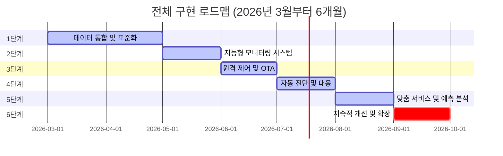

---

## 2. 데이터 통합 플랫폼 프로세스

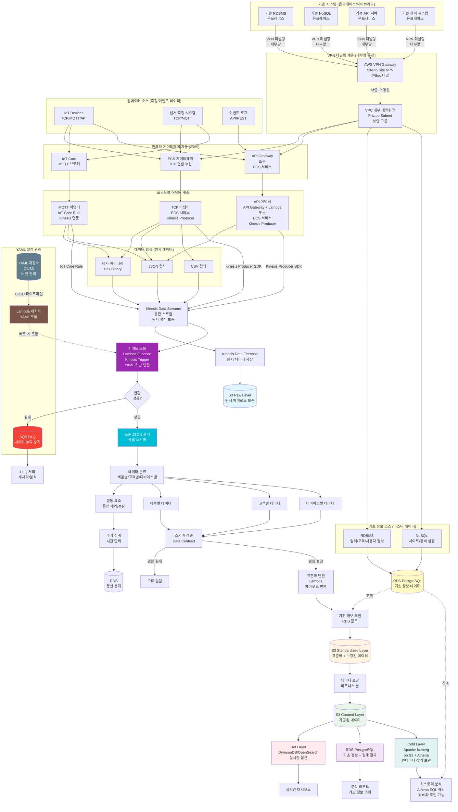

---

## 2-1. 실시간 데이터 수집 및 다중 프로토콜 통합 프로세스

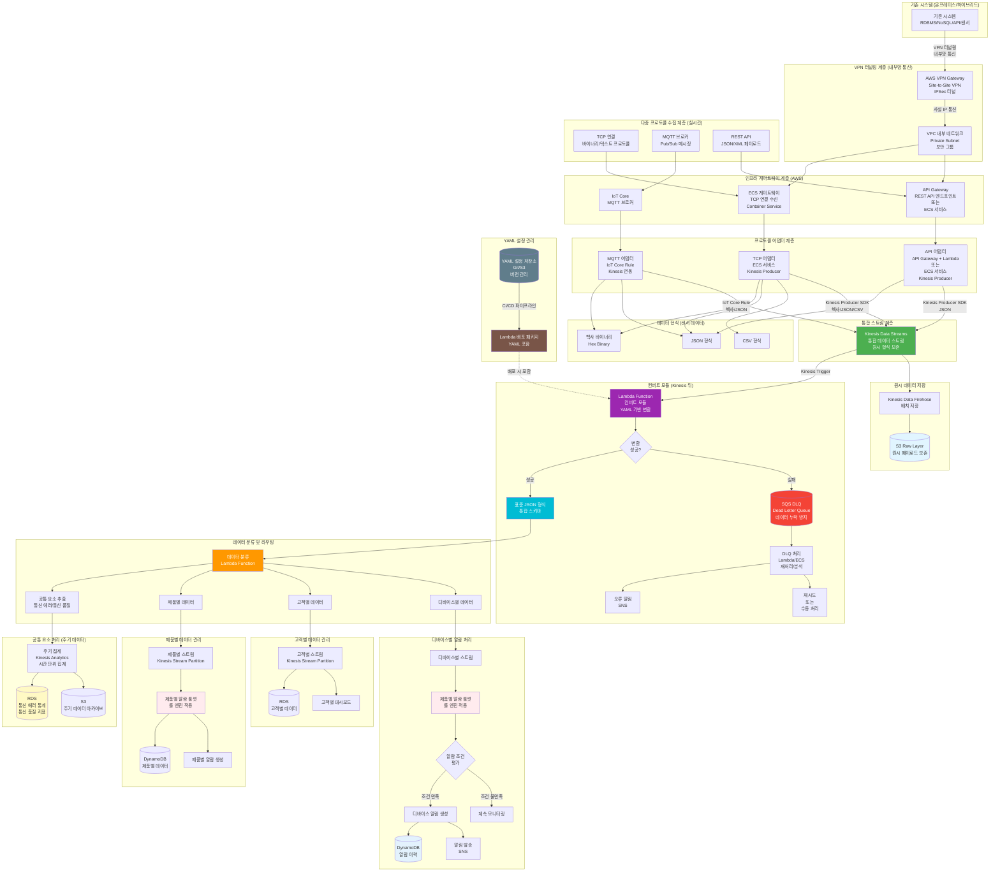

### 인프라 게이트웨이 및 프로토콜별 처리 특성

#### TCP 프로토콜
- **인프라 구성**: ECS 게이트웨이 (Container Service) 필요
- **특징**: 바이너리 또는 텍스트 기반 프로토콜, 지속 연결
- **데이터 형식**: 헥사 바이너리, JSON, CSV 등 다양한 형식 지원
- **처리 흐름**:
  1. TCP 연결 → ECS 게이트웨이 (TCP 포트 리스닝)
  2. ECS 게이트웨이 → ECS 서비스 (TCP 어댑터)
  3. ECS 서비스 → Kinesis Producer SDK → Kinesis Data Streams
  4. Kinesis → Lambda 컨버트 모듈 → YAML 로직 적용 → JSON 표준 형식
- **ECS 구성**: Fargate 또는 EC2 기반, 로드 밸런서(NLB) 연동, Auto Scaling

#### MQTT 프로토콜
- **인프라 구성**: AWS IoT Core (관리형 MQTT 브로커)
- **특징**: Pub/Sub 메시징, 토픽 기반 라우팅
- **데이터 형식**: 헥사 바이너리, JSON 등
- **처리 흐름**:
  1. MQTT 클라이언트 → AWS IoT Core (MQTT 브로커)
  2. IoT Core Rule → Kinesis Data Streams (직접 연동)
  3. Kinesis → Lambda 컨버트 모듈 → YAML 로직 적용 → JSON 표준 형식
- **IoT Core 기능**: Device Gateway, Rule Engine, 보안 인증

#### REST API 프로토콜
- **인프라 구성**: API Gateway 또는 ECS 서비스 필요
- **옵션 1 (API Gateway)**: 
  - API Gateway → Lambda → Kinesis Producer SDK → Kinesis Data Streams
  - 특징: 서버리스, 자동 스케일링, API 버전 관리
- **옵션 2 (ECS 서비스)**:
  - API Gateway 또는 ALB → ECS 서비스 → Kinesis Producer SDK → Kinesis Data Streams
  - 특징: 컨테이너 기반, 세밀한 제어, 높은 성능
- **데이터 형식**: 주로 JSON 형식
- **처리 흐름**:
  1. HTTP 요청 → API Gateway/ECS
  2. API Gateway/ECS → Lambda/ECS 서비스
  3. Lambda/ECS → Kinesis Producer SDK → Kinesis Data Streams
  4. Kinesis → Lambda 컨버트 모듈 → YAML 로직 적용 → 표준 JSON 형식

### 데이터 형식 변환 (YAML 기반 컨버트 모듈)

**위치**: Kinesis Data Streams 뒤 (Kinesis Trigger로 Lambda 실행)

**처리 순서**:
1. 프로토콜 어댑터 → 원시 데이터 형식 (헥사/JSON/CSV) → Kinesis Data Streams
2. Kinesis Data Streams → Lambda Trigger → 컨버트 모듈 (Lambda Function)
3. 컨버트 모듈 → YAML 규칙 적용 → 표준 JSON 형식
4. 변환 실패 시 → SQS DLQ → 재처리/분석

#### 지원 데이터 형식
1. **헥사 바이너리 (Hex Binary)**
   - 특징: 바이너리 데이터의 16진수 표현
   - 예시: `0x01A2B3C4D5E6F7`
   - 변환: YAML 규칙 기반 바이트 파싱 및 필드 추출
   - **파싱 방식**:
     - **길이 기반 파싱 (Length-based)**: 고정된 바이트 길이로 필드를 분리
       - 예: offset 0부터 2바이트 = 첫 번째 필드, offset 2부터 1바이트 = 두 번째 필드
     - **Key-Value 파싱**: 키-값 쌍 형태로 데이터가 구성된 경우
       - 예: `0x4B65794156616C` (KeyA=Val 형태의 구조)
     - **하이브리드 파싱 (Separator + Length)**: 특정 세퍼레이터(키값)를 기준으로 구간을 분리하고, 각 구간 내에서 길이 기반으로 여러 키값 파싱
       - 예: 세퍼레이터 `0xAA`를 기준으로 구간 분리 → 각 구간에서 길이 기반 파싱으로 여러 필드 추출

2. **JSON 형식**
   - 특징: 구조화된 데이터 형식
   - 예시: `{"temperature": 25.5, "humidity": 60}`
   - 변환: YAML 규칙 기반 필드 매핑 및 스키마 변환

3. **CSV 형식**
   - 특징: 쉼표로 구분된 텍스트 데이터
   - 예시: `timestamp,temperature,humidity\n2026-03-01 10:00:00,25.5,60`
   - 변환: YAML 규칙 기반 컬럼 매핑 및 타입 변환

#### YAML 컨버트 모듈 구조

**YAML 관리 방식**:
- **버전 관리 저장소**: Git 또는 S3에 YAML 설정 파일 저장 및 버전 관리 (별도 관리)
- **배포 방식**: Lambda 배포 시 YAML 파일을 Lambda 패키지(ZIP)에 포함하여 함께 배포
- **관리 프로세스**: 
  1. YAML 변경 시 Git/S3 저장소에 업데이트
  2. CI/CD 파이프라인에서 Lambda 패키지에 YAML 포함
  3. Lambda 재배포 (YAML 변경 시 전체 Lambda 재배포)
- **제품별 규칙**: 제품 타입별로 다른 변환 규칙 적용
- **디바이스별 규칙**: 디바이스 모델별 세부 변환 규칙
- **변환 실행**: Lambda 내 YAML 로직 엔진을 통한 자동 변환 수행

**DLQ (Dead Letter Queue) 처리**:
- **목적**: 데이터 누락 방지 및 오류 데이터 보존
- **구현**: Lambda 실패 시 SQS Dead Letter Queue로 자동 전송
- **Lambda DLQ 설정**: Lambda Function의 Dead Letter Queue 설정을 통해 자동 전송
- **처리**: DLQ Lambda/ECS를 통한 재처리, 오류 분석, 수동 처리
- **알림**: DLQ 메시지 발생 시 SNS를 통한 즉시 알림
- **데이터 보존**: DLQ에 저장된 데이터를 통한 재처리 및 분석 가능

#### YAML 변환 규칙 예시

**1. 길이 기반 파싱 (Length-based Parsing)**
```yaml
# 제품 A - 헥사 바이너리 변환 규칙 (길이 기반)
product_type: "product_a"
format: "hex_binary"
parsing_type: "length_based"
conversion:
  - field: "temperature"
    offset: 0
    length: 2
    type: "int16"
    scale: 0.1
    unit: "celsius"
  - field: "humidity"
    offset: 2
    length: 1
    type: "uint8"
    unit: "percent"
  output_schema:
    tenant: "${device.tenant}"
    device_id: "${device.id}"
    timestamp: "${ingest_time}"
    metrics: "${converted_fields}"
```

**2. Key-Value 파싱 (Key-Value Parsing)**
```yaml
# 제품 B - 헥사 바이너리 변환 규칙 (Key-Value 형태)
product_type: "product_b"
format: "hex_binary"
parsing_type: "key_value"
conversion:
  - key: "0x0001"  # 키 값 (2바이트)
    field: "temperature"
    value_length: 2
    type: "int16"
    scale: 0.1
    unit: "celsius"
  - key: "0x0002"  # 키 값 (2바이트)
    field: "humidity"
    value_length: 1
    type: "uint8"
    unit: "percent"
  output_schema:
    tenant: "${device.tenant}"
    device_id: "${device.id}"
    timestamp: "${ingest_time}"
    metrics: "${converted_fields}"
```

**3. 하이브리드 파싱 (Separator + Length-based Parsing)**
```yaml
# 제품 C - 헥사 바이너리 변환 규칙 (세퍼레이터 + 길이 기반)
product_type: "product_c"
format: "hex_binary"
parsing_type: "hybrid"
separator: "0xAA"  # 세퍼레이터 (1바이트)
sections:
  - section_id: 1
    conversion:
      - field: "temperature"
        offset: 0
        length: 2
        type: "int16"
        scale: 0.1
        unit: "celsius"
      - field: "humidity"
        offset: 2
        length: 1
        type: "uint8"
        unit: "percent"
  - section_id: 2
    conversion:
      - field: "pressure"
        offset: 0
        length: 4
        type: "int32"
        scale: 0.01
        unit: "hPa"
  output_schema:
    tenant: "${device.tenant}"
    device_id: "${device.id}"
    timestamp: "${ingest_time}"
    metrics: "${all_sections_merged}"
```

**파싱 방식별 특징**:
- **길이 기반 파싱**: 고정 길이 구조에 적합, 파싱 속도 빠름, 스키마 변경 시 YAML 업데이트 필요
- **Key-Value 파싱**: 유연한 구조, 순서 독립적, 키 검색 오버헤드 존재
- **하이브리드 파싱**: 복합 구조 처리 가능, 세퍼레이터로 구간 분리 후 각 구간별로 길이 기반 파싱, 복잡한 프로토콜 지원

**4. CSV 변환 규칙 예시**
```yaml
# 제품 D - CSV 변환 규칙
product_type: "product_d"
format: "csv"
conversion:
  delimiter: ","
  header: true
  mapping:
    - source: "temp"
      target: "temperature"
      type: "float"
      unit: "celsius"
    - source: "hum"
      target: "humidity"
      type: "float"
      unit: "percent"
  output_schema:
    tenant: "${device.tenant}"
    device_id: "${device.id}"
    timestamp: "${timestamp}"
    metrics: "${mapped_fields}"
```

### 데이터 분류 기준

#### 공통 요소 (주기 데이터)
- 통신 에러 통계: 연결 실패, 타임아웃, 패킷 손실 등
- 통신 품질 지표: 지연 시간, 처리량, 가용성 등
- 처리 방식: 시간 단위 집계 (1분, 5분, 1시간)
- 저장소: RDS (통계), S3 (아카이브)

#### 제품별 데이터 관리
- 제품 타입별로 Kinesis Stream 파티션 분리
- 제품별 알람 룰셋 정의 및 적용
- 제품별 데이터베이스 분리 또는 태깅

#### 고객별 데이터 관리
- 고객 ID 기반 Kinesis Stream 파티션 분리
- 고객별 데이터 격리 및 권한 관리
- 고객별 맞춤 대시보드 제공

#### 디바이스별 알람 처리
- 디바이스 ID 기반 스트림 라우팅
- 제품 타입에 따라 해당 제품의 알람 룰셋 적용
- 알람 이력 관리 및 알림 발송

---

## 2-2. 파일 데이터 배치 처리 프로세스 (별도 Job)

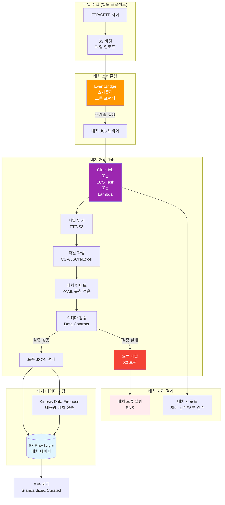

### 파일 배치 처리 특징

- **별도 프로젝트**: 실시간 데이터 수집과 분리된 별도 배치 Job으로 처리
- **스케줄링**: EventBridge 크론 표현식을 통한 주기적 실행 (일/시간 단위)
- **처리 방식**: Glue Job, ECS Task, 또는 Lambda를 통한 대용량 파일 처리
- **데이터 저장**: S3 Raw Layer에 직접 저장 또는 Kinesis Data Firehose를 통한 전송
- **오류 처리**: 검증 실패 파일은 별도 S3 경로에 보관 및 알림 발송
- **YAML 규칙**: 배치 Job에도 동일한 YAML 변환 규칙 적용 가능

---

## 3. 지능형 모니터링 및 알람 프로세스 (제품별 룰셋 적용)

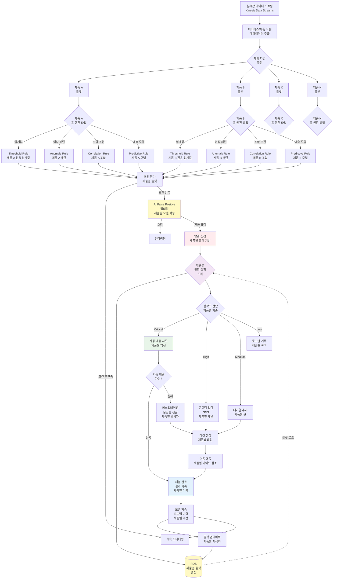

---

## 4. 원격 제어 프로세스 (Shadow 기반)

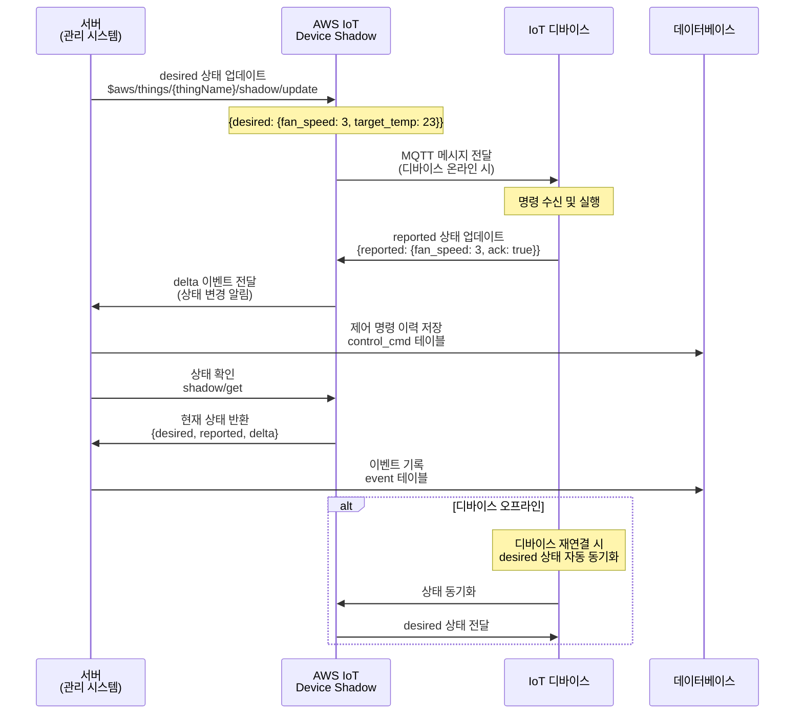

---

## 5. OTA (Over-The-Air) 업데이트 프로세스

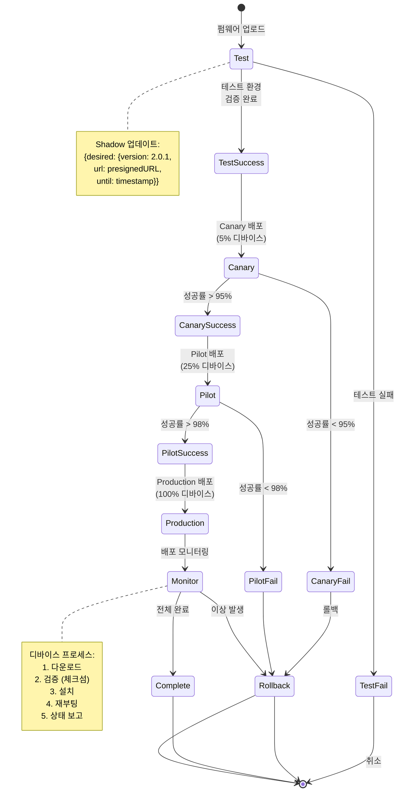

---

## 6. 자동 진단 및 대응 프로세스 (폐쇄 루프)

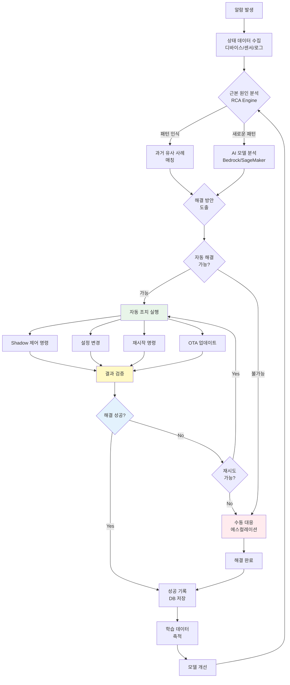

---

## 7. 통신 오류 배치 체크 프로세스

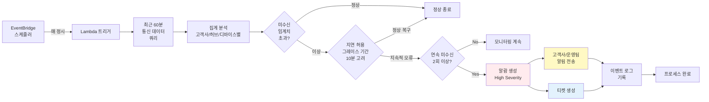

---

## 8. 전체 시스템 아키텍처 프로세스

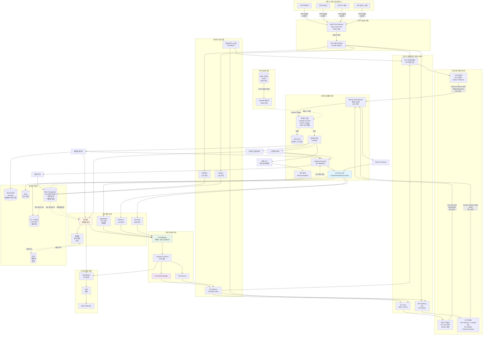

---

## 9. 데이터 생명주기 관리 프로세스

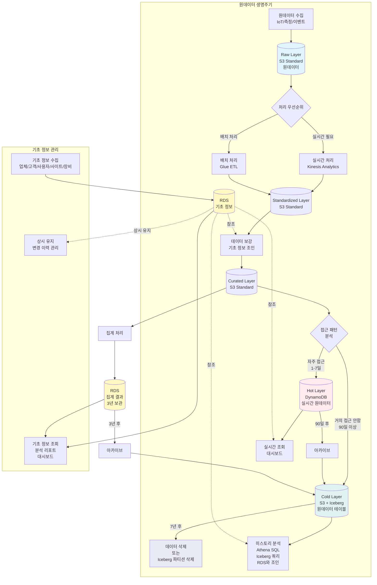

---

## 10. 고객별 맞춤 서비스 프로세스

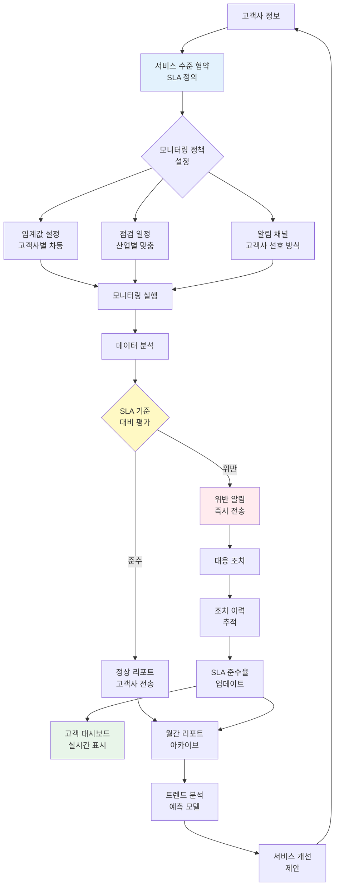

---

## 주요 특징 요약

### 실시간 데이터 수집 및 통합
- **다중 프로토콜 지원**: TCP, MQTT, REST API 등 다양한 프로토콜 통합 (파일은 별도 배치 처리)
- **VPN 터널링 (기존 시스템 연동)**:
  - **목적**: 이전 시스템과 AWS 연동을 위한 보안 통신
  - **구성**: AWS VPN Gateway (Site-to-Site VPN, IPSec 터널)
  - **네트워크**: VPC 내부 네트워크 (Private Subnet)를 통한 내부망 통신
  - **보안**: 사설 IP 통신으로 퍼블릭 노출 없이 기존 시스템과 통신
  - **연동 대상**: 기존 RDBMS, NoSQL, API 서버, 센서 시스템 등
- **인프라 게이트웨이**:
  - **TCP**: ECS 게이트웨이 필요 (TCP 포트 리스닝을 위한 Container Service)
  - **MQTT**: AWS IoT Core (관리형 MQTT 브로커)
  - **REST API**: API Gateway 또는 ECS 서비스 필요
- **Kinesis 연동 방식**:
  - **TCP/API**: Kinesis Producer SDK를 통한 직접 전송 (ECS 서비스 또는 Lambda)
  - **MQTT**: IoT Core Rule Engine을 통한 자동 Kinesis 연동
- **다중 데이터 형식**: 헥사 바이너리, JSON, CSV 등 다양한 데이터 형식 지원
- **통합 스트림**: Kinesis Data Streams를 통한 모든 데이터의 단일 진입점 (원시 형식 보존)
- **컨버트 모듈 위치**: Kinesis Data Streams 뒤에서 Lambda Function으로 실행 (Kinesis Trigger)
- **YAML 기반 변환**: 제품별/디바이스별 변환 규칙을 YAML로 관리 (Lambda 패키지에 포함)
- **YAML 관리**: Git/S3에서 버전 관리, CI/CD 파이프라인을 통한 Lambda 재배포
- **DLQ 처리**: Lambda 실패 시 SQS DLQ로 전송하여 데이터 누락 방지 및 재처리
- **페이로드 변환**: YAML 로직을 통한 표준 JSON 형식 변환
- **원시 데이터 보존**: S3 Raw Layer에 원본 페이로드(헥사/CSV/JSON) 보존으로 재처리 가능

### 파일 데이터 배치 처리
- **별도 프로젝트**: 실시간 처리와 분리된 별도 배치 Job으로 처리
- **스케줄링**: EventBridge 크론 표현식을 통한 주기적 실행
- **처리 방식**: Glue Job, ECS Task, 또는 Lambda를 통한 대용량 파일 처리
- **YAML 규칙**: 배치 Job에도 동일한 YAML 변환 규칙 적용 가능

### 데이터 분류 및 관리
- **공통 요소 (주기 데이터)**: 통신 에러, 통신 품질 등 시간 단위 집계 처리 (Kinesis Analytics → RDS)
- **제품별 관리**: 제품 타입별 스트림 파티션 분리 및 제품별 알람 룰셋 적용 (RDS에서 동적 로드)
- **고객별 관리**: 고객 ID 기반 스트림 파티션 분리, 데이터 격리 및 맞춤 대시보드 제공
- **디바이스별 처리**: 디바이스별 스트림 라우팅 및 제품별 룰셋 기반 알람 처리 (DynamoDB + SNS)

### 제품별 알람 룰셋 시스템
- **제품 타입 식별**: 디바이스 메타데이터 기반 자동 제품 타입 식별
- **룰셋 관리**: RDS에 저장된 제품별 알람 룰셋 동적 로드
- **룰 엔진 적용**: 제품별로 다른 임계값, 패턴, 조합, 예측 모델 적용
- **자동화 대응**: 제품별 자동 대응 액션 및 알림 채널 관리
- **지속적 개선**: 제품별 피드백 기반 룰셋 최적화

## 사용 방법

이 문서의 Mermaid 다이어그램은 다음 도구에서 확인할 수 있습니다:

1. **GitHub/GitLab**: README나 마크다운 파일에서 자동 렌더링
2. **VS Code**: Mermaid Preview 확장 프로그램 설치
3. **온라인 에디터**: [Mermaid Live Editor](https://mermaid.live/)
4. **Notion, Confluence**: Mermaid 플러그인 사용

---

**최종 업데이트**: 2026년 3월
