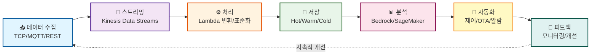
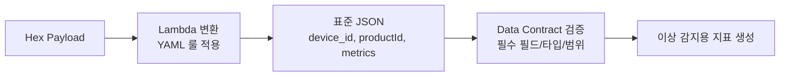
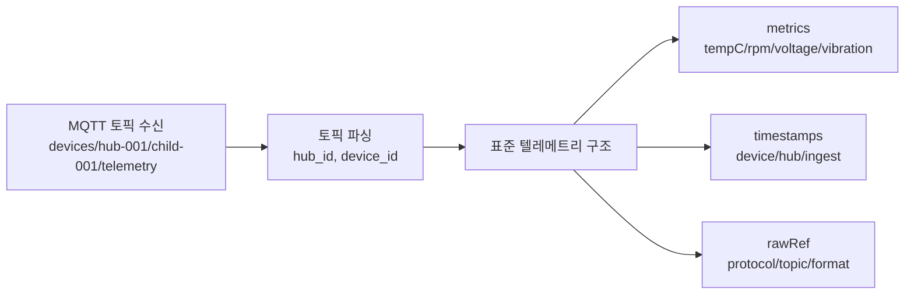
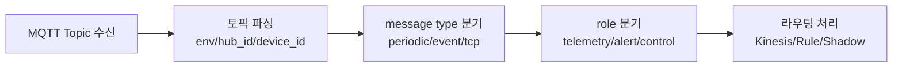
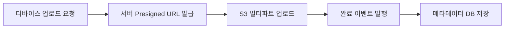
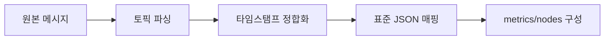
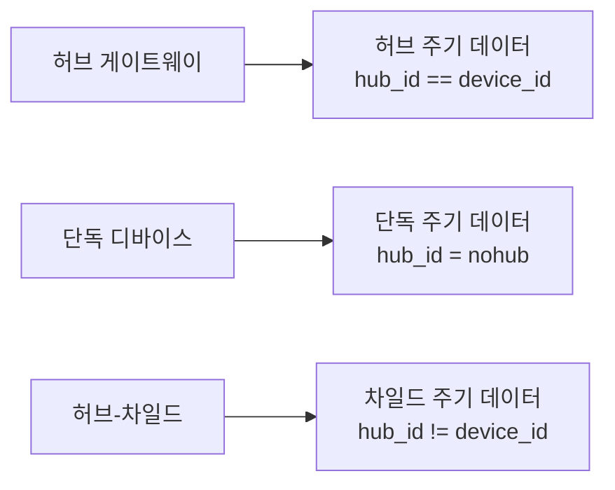
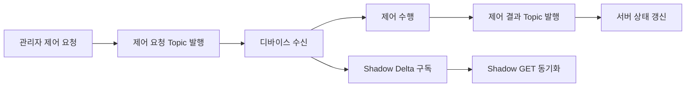

# 설계 문서 가이드 (처음부터 끝까지)

## 📖 이 문서의 목적

이 문서는 **설계 문서 모드**에서 프로젝트를 "처음 → 끝" 순서로 이해할 수 있도록 **문서 목록(역할/읽는 순서)**과 **대표 예시 시나리오**를 제공하는 가이드입니다. 특히 **다양한 종류의 데이터를 최대한 통합해 관리하는 목적**이 모든 문서에 일관되게 반영되도록 구성합니다.

**이 문서를 먼저 읽으세요!** 각 설계 문서의 역할과 읽는 순서를 안내합니다.

### ✅ 통합 관리 범위 (공통 전제)
- **프로토콜**: TCP, MQTT, REST API
- **데이터 형식**: Hex Binary, JSON, CSV
- **원천 시스템**: IoT 센서, 파일 배치, RDBMS, NoSQL
- **저장 계층**: DocumentDB(Hot), Aurora(Warm), S3+Iceberg(Cold)

### 🧩 통합 대상 데이터 (유형별)
| 유형 | 예시 | 주요 처리 |
| --- | --- | --- |
| 센서/텔레메트리 | 주기 데이터, 이벤트 데이터 | 표준화, 품질 검증, 집계 |
| 제어/상태 | Shadow 명령, 제어 결과 | 제어 이력 저장, 상태 동기화 |
| 펌웨어/OTA | 업데이트 요청, 상태 코드 | 배포/롤백 이력 관리 |
| 파일/이미지/로그 | 이미지/로그 업로드 | 메타데이터 저장, S3 저장 |
| 마스터/기초정보 | 고객/사이트/디바이스 | 조인/정합성 검증 |
| 알람/이력 | 알람 발생/해제 | 룰 평가, 이력 저장 |

### 🗃️ 데이터 유형별 저장소 매핑
| 데이터 유형 | Hot (DocumentDB) | Warm (DocumentDB) | Warm (Aurora) | Cold (S3+Iceberg) |
| --- | --- | --- | --- | --- |
| 센서/텔레메트리 | 실시간 원본/요약 | - | 고객별 일별 집계 | 장기 보관 |
| 제어/상태 | 최신 상태 | 제어 이력 | - | 장기 이력 |
| 펌웨어/OTA | 진행 상태 | 배포/롤백 이력 | - | 장기 보관 |
| 파일/이미지/로그 | 메타 캐시 | - | 메타데이터 | 원본 파일 |
| 마스터/기초정보 | - | - | 정합성 기준 | 스냅샷 |
| 알람/이력 | 실시간 알람 | 처리 이력 | - | 장기 분석 |

---

## 📚 문서 목록 (권장 읽는 순서)

### 0️⃣ `DESIGN_GUIDE.md` (이 문서) - **시작점**
- **목적**: 전체 설계 문서 흐름 안내, 용어/전제/예시 제공
- **읽는 사람**: 모든 이해관계자 (처음 접하는 사람 필수)
- **읽는 시간**: 약 10분
- **핵심 내용**:
  - 문서 읽는 순서 및 각 문서의 역할
  - 전체 시스템 흐름 한 장 요약
  - 실제 시나리오 예시 (센서 → 알람 → 자동 복구)
  - 샘플 데이터 형식

### 1️⃣ `SERVICE_OVERVIEW.md` (서비스 개요) - **비즈니스 관점**
- **목적**: 서비스 가치/범위/성과지표(KPI) 등 **비즈니스 관점** 요약
- **읽는 사람**: 경영진, 의사결정자, 비즈니스 담당자
- **읽는 시간**: 약 15분
- **핵심 내용**:
  - 해결하는 문제 5가지
  - 제공하는 가치 (KPI 개선)
  - 핵심 운영 사이클
  - 비즈니스 모델 (SaaS)
  - 예상 성과 지표
- **주의**: 상세 구현/다이어그램은 여기서 다루지 않음 (중복 방지)

### 2️⃣ `PROCESS_FLOW.md` (프로세스 플로우) - **시스템 흐름**
- **목적**: **전체 데이터 흐름**과 단계별 프로세스를 Mermaid 다이어그램으로 "그림 + 절차"로 설명
- **읽는 사람**: 시스템 아키텍트, 개발팀, 프로젝트 관리자
- **읽는 시간**: 약 30-40분 (다이어그램 포함)
- **핵심 내용**:
  - 통합 데이터 플랫폼 프로세스 (센서 데이터 통합 + 기초 데이터 통합)
  - 실시간 데이터 수집 (TCP/MQTT/REST)
  - 데이터 표준화 및 변환
  - 모니터링 및 알람 프로세스
  - 원격 제어 및 OTA 프로세스
  - 자동 진단 및 대응 프로세스
- **포인트**: ingestion → standardize → store → analyze → alert/control/ota → feedback

### 3️⃣ `PROJECT_ANALYSIS.md` (기술 분석) - **기술 상세**
- **목적**: 기술 스택/아키텍처 결정 근거, CQRS, 보안, 운영 관점의 **기술 상세**
- **읽는 사람**: 개발팀, 기술 리더, 아키텍트
- **읽는 시간**: 약 20-30분
- **핵심 내용**:
  - 통합 데이터 플랫폼 기술적 구현 상세
  - 데이터 저장 계층 (Hot/Warm/Cold) 상세
  - CQRS 패턴 적용 (DocumentDB, Aurora)
  - AI/ML 서비스 역할 분리 (Bedrock vs SageMaker)
  - Lambda 함수 구조 (Node.js 20.x, ESM 모듈)
  - 보안 및 인증 (Cognito, Secrets Manager)
  - 필요한 AWS 리소스 목록
- **포인트**: Aurora(Document) CQRS, Bedrock/SageMaker 역할 분리, Lambda(Node.js 20 ESM)

### 4️⃣ `README.md` (웹 애플리케이션 가이드) - **도구 사용법**
- **목적**: 이 문서를 보여주는 **웹 앱(설계 문서/프레젠테이션/대시보드) 사용/구조/개발 방법**
- **읽는 사람**: 개발자, 웹 앱 사용자
- **읽는 시간**: 약 10분
- **핵심 내용**:
  - 웹 애플리케이션 3가지 모드 (프레젠테이션/대시보드/설계 문서)
  - 설치 및 실행 방법
  - 프로젝트 구조
  - 개발 가이드
- **주의**: 시스템 설계 자체의 중복 설명은 최소화

---

## 🧭 전체 설계 흐름 (한 장 요약)

### 큰 흐름 (End-to-End)



#### 1. 수집 (Ingestion)
- **TCP**: ECS 서비스가 연결을 유지하며 수신 → Kinesis Producer SDK → Kinesis Data Streams
- **MQTT**: IoT Core (MQTT 브로커) → Kinesis Data Streams
- **REST API**: ECS 서비스 (특별한 경우만 API Gateway) → Kinesis Data Streams
- **VPN 터널링**: 기존 온프레미스 시스템과 AWS 간 안전한 연동

#### 2. 스트리밍 (Streaming)
- **Kinesis Data Streams**: 모든 센서 데이터를 단일 스트림으로 통합

#### 3. 처리 (Processing)
- **Lambda 중심**: 컨버트/분류/표준화/조인/계산식
  - Node.js 20.x, ESM 모듈
  - YAML 기반 데이터 변환 룰
  - Data Contract 기반 스키마 검증

#### 4. 저장 (Storage) - 3계층 구조
- **Hot Layer**: DocumentDB (CQRS: Read/Write 분리)
  - 실시간 대시보드, 즉시 조회
  - **제품별 시간별/일별 집계** (센서 데이터에는 고객 정보 없음)
- **Warm Layer**: Aurora PostgreSQL (CQRS: Read/Write 분리)
  - 통합 기초 정보, **일별 고객별 집계**, **계산식 적용 분석 데이터**, 알람 이력, 에러 알림 처리 서비스 정보
  - 고객 정보 조인 후 집계 및 계산식 적용
- **Cold Layer**: S3 + Iceberg + Athena
  - 장기 보관, 히스토리 분석

#### 5. 분석 (Analytics)
- **Bedrock**: LLM 기반 분석
  - 이상 탐지
  - 근본 원인 분석 (RCA)
- **SageMaker**: ML 모델 기반 예측 분석
  - 시계열 예측
  - 예지정비

#### 6. 자동화 (Automation)
- 알람 → 제어(Shadow) → OTA → 검증(폐쇄 루프)

#### 7. 보안 (Security)
- **Cognito**: 사용자 인증/권한
- **Secrets Manager**: DB 자격증명 등 시크릿 관리

---

## ✅ 일반적인 예시 시나리오 (End-to-End)

아래는 "현장에서 자주 나오는" 대표 시나리오를 **일반 예시**로 구성한 것입니다. (실제 고객/제품 값은 치환)

### 예시 A) 센서 이상 징후 → 알람 → 자동 복구 → 검증

**시나리오**: 제품 A의 온도 센서가 임계값을 초과하여 이상 징후가 감지되고, 자동으로 복구 조치가 실행되는 전체 프로세스

#### 단계별 상세 설명

1. **디바이스 데이터 전송**
   - 제품 A 디바이스가 5초마다 텔레메트리 데이터 전송
   - 데이터 형식: Hex Binary (예: `0x01 0x4E 0x02 0x03 0xE8 ...`)

2. **TCP 수신 (ECS 게이트웨이)**
   - TCP 연결이 필요한 장비는 **ECS 게이트웨이**가 연결을 유지하며 수신
   - ECS 서비스가 지속적으로 연결을 모니터링

3. **Kinesis Data Streams 적재**
   - 수신 데이터는 **Kinesis Producer SDK**를 통해 **Kinesis Data Streams**로 적재
   - 스트림에 데이터가 실시간으로 쌓임

4. **Lambda 변환/표준화**
   - **Lambda Function (Node.js 20.x, ESM)**이 YAML 룰을 읽어 Hex → JSON 변환
   - 변환 결과는 아래 플로우로 표현



5. **DocumentDB 저장 (Hot Layer)**
   - 표준화된 이벤트가 **DocumentDB Write Endpoint**에 저장
   - 실시간 대시보드에서 즉시 조회 가능

6. **룰 엔진 이상 감지**
   - 룰 엔진이 임계치 기반 이상 감지
   - 예시 룰: `tempC > 80` → 알람 발생
   - 제품별 룰셋이 Aurora에서 동적으로 로드됨

7. **Bedrock 근본 원인 분석 (RCA)**
   - **Bedrock**이 이상 데이터를 분석하여 원인 후보 및 권장 조치 생성
   - 예시 출력: "온도 상승 원인: 냉각 팬 고장 가능성 높음. 권장 조치: 팬 재시작"

8. **자동 대응 (Shadow 제어)**
   - 자동 대응 조건이면 **IoT Device Shadow**를 통해 제어 명령 실행
   - 예시: 재부팅, 설정 변경, 팬 속도 증가 등

9. **결과 검증 (폐쇄 루프)**
   - 제어 후 결과를 다시 수집/검증
   - 온도가 정상 범위로 돌아오면 알람을 자동 종료
   - 실패 시 에스컬레이션 (기사 출동 또는 원격 지원)

10. **이력 기록 (DocumentDB Warm Layer)**
    - 알람 이력, 조치 내역은 **DocumentDB Write Endpoint**에 기록 (Warm 데이터)
    - 에러 알림 처리 서비스 정보는 **Aurora Write Endpoint**에 기록
    - 리포트 및 분석에 활용

### 예시 B) 데이터 집계 및 분석 데이터 생성

**시나리오**: 센서 데이터를 집계하고, 고객 정보를 조인하여 계산식을 적용한 분석 데이터를 생성하는 프로세스

#### 단계별 상세 설명

1. **센서 데이터 수집**
   - 센서 데이터는 `device_id`, `productId`, `device_timestamp`, `metrics`만 포함 (고객 정보 없음)

2. **제품별 시간별/일별 집계 (DocumentDB)**
   - EventBridge 스케줄러가 1시간/6시간/일 단위로 트리거
   - Lambda Function이 DocumentDB에서 센서 데이터 조회
   - 제품별로 그룹화하여 시간별/일별 집계 계산
   - 집계 결과를 DocumentDB에 저장 (제품별 시간별/일별 집계)

3. **고객별 제품별 일별 집계 (Aurora)**
   - EventBridge 스케줄러가 일 단위로 트리거 (매일 자정)
   - Lambda Function이 DocumentDB에서 제품별 일별 집계 조회
   - Aurora의 기초 정보와 조인 (`device_id` → `site_id` → `customer_id`)
   - 고객별 제품별로 그룹화하여 일별 집계 계산
   - 집계 결과를 Aurora에 저장

4. **계산식 적용 및 분석 데이터 생성**
   - 고객별 집계 완료 후 Lambda Function 트리거
   - Aurora에서 계산식 조회 (고객별/제품별)
   - 고객별 제품별 일별 집계 데이터에 계산식 평가
   - 계산 결과를 분석 데이터 테이블에 저장 (Aurora)

5. **관리 화면 표시**
   - 관리 화면이 Aurora Read Endpoint에서 분석 데이터 조회
   - 고객별 제품별 일별 분석 데이터를 차트/테이블로 표시

---

## 🧩 예시 데이터 (샘플)

### 1) 표준화된 텔레메트리(Flow) 예시

**중요**: 센서 데이터에는 고객 정보(`customer_id`, `site_id`)가 포함되지 않습니다. 센서 데이터는 디바이스 식별자(`device_id`, `productId`)와 측정값(`metrics`)만 포함합니다. 고객 정보는 기초 데이터(Aurora)에서 `device_id`를 통해 조인하여 얻습니다.



**필드 설명**:
- `device_id`: 디바이스 고유 식별자 (토픽에서 추출, 필수)
- `device_timestamp`: 디바이스에서 생성된 타임스탬프 (ISO 8601, 디바이스 측 시간)
- `hub_id`: 허브 디바이스 ID (차일드 디바이스인 경우, 토픽에서 추출)
- `hub_timestamp`: 허브에서 수신/전달한 타임스탬프 (ISO 8601, 허브 측 시간)
- `productId`: 제품 타입 식별자 (필수)
- `childDeviceId`: 차일드 디바이스 ID (허브-차일드 구조인 경우, 토픽에서 추출)
- `metrics`: 측정값 (제품별로 다름)
- `rawRef`: 원본 데이터 참조 정보 (프로토콜, 토픽, 원본 형식 등)
- `ingest_timestamp`: 플랫폼 수신 타임스탬프 (ISO 8601, Kinesis 수신 시점, 자동 생성)

### 2) 계산식 등록(분석 데이터 생성) 예시

**목적**: 분석용 파생지표(예: 건강도/효율/이상 점수)를 "코드 변경 없이" 운영자가 등록

**저장소**: Aurora (정합성/버전관리/권한)

**예시 계산식 (개념)**:
```yaml
formulaId: "health-score-prod-a"
productId: "prod-a"
formula: "clamp(100 - (tempC - 60) * 2 - vibration * 10, 0, 100)"
description: "제품 A 건강도 점수 (0-100)"
```

> **실제 구현**: 안전을 위해 허용 함수/연산만 제공하고, 샌드박스 평가 후 Lambda에서 계산합니다.

### 3) 알람 룰셋 예시

```yaml
ruleId: "temp-threshold-prod-a"
productId: "prod-a"
type: "threshold"
condition: "metrics.tempC > 80"
severity: "high"
autoAction: "restart-fan"
```

---

## 📌 추가 예시 (일반화된 토픽/룰/업로드)

### 1) 토픽 구조 (일반화)

**기본 형식**:
- `iotlink/{env}/{hub_id}/{device_id}/{type}/{direction}/{role}/{format}`
- `env`: dev | stg | prd
- `type`: periodic | event | tcp
- `direction`: pub | sub
- `role`: telemetry | alert_report | control_request | control_result
- `format`: json | bin



### 2) IoT Rule 예시 (일반화)

**주기 데이터 처리용 Rule**:
- `Rule Name`: `periodic_rule`
- `Topic`: `iotlink/+/+/+/periodic/+/+/+`

```sql
SELECT
  *,
  topic(1) AS env,
  topic(2) AS hub_id,
  topic(3) AS device_id,
  topic(4) AS data_type,
  topic(5) AS direction,
  topic(6) AS role,
  topic(7) AS format,
  header.timestamp AS device_time,
  timestamp() AS server_time
FROM 'iotlink/+/+/+/periodic/+/+/+'
```

### 3) 프로비저닝 완료 이벤트 (일반화)

```mermaid
flowchart LR
  A[디바이스 프로비저닝 완료] --> B[완료 이벤트 발행]
  B --> C[Topic: iotlink/{env}/{hub_id}/{device_id}/event/pub/provisioning_complete/json]
  C --> D[IoT Rule 수신]
  D --> E[Device Registry 갱신]
```

### 4) 이미지 업로드 프로세스 (일반화)



### 5) 공통 페이로드 구조 (일반화)

**JSON 페이로드 기본 형태**:
```json
{
  "hub_timestamp": 1756653767451,
  "device_timestamp": 1756653767451,
  "data": {
    "metrics": {
      "tempC": 26.3,
      "rpm": 1200
    }
  },
  "nodes": [
    {
      "device_id": "child-01",
      "role": "EndDevice",
      "parent": "hub-01"
    }
  ]
}
```

**바이너리 페이로드 기본 형태**:
```json
{
  "device_timestamp": 1756653767451,
  "data": {
    "bin": "HEX_OR_BASE64_PAYLOAD"
  }
}
```



### 6) 주기 데이터 유형 (허브/단독/허브-차일드)



**허브 주기 데이터 토픽 예시**:
- `iotlink/stg/hub-01/hub-01/periodic/pub/telemetry/json`

**단독 주기 데이터 토픽 예시**:
- `iotlink/stg/nohub/device-01/periodic/pub/telemetry/json`

**허브-차일드 주기 데이터 토픽 예시**:
- `iotlink/stg/hub-01/device-01/periodic/pub/telemetry/json`

### 7) 제어 요청/응답 및 Shadow 흐름 (일반화)



**제어 요청 토픽 예시**:
- `iotlink/{env}/{hub_id}/{device_id}/event/pub/control_request/json`

**제어 결과 토픽 예시**:
- `iotlink/{env}/{hub_id}/{device_id}/event/pub/control_result/json`

---

## 🧪 예제 코드 (샘플)

### 1) Lambda 컨버트 모듈 (Node.js 20.x, ESM)

```javascript
// 파일: convert-handler.mjs
export const handler = async (event) => {
  const records = event.Records || [];
  const outputs = [];

  for (const record of records) {
    const payload = Buffer.from(record.kinesis.data, "base64").toString("utf-8");
    const parsed = JSON.parse(payload); // 예시: JSON 형식

    // 토픽에서 hub_id, device_id 추출
    const topic = parsed?.rawRef?.topic || "";
    const parts = topic.split("/");
    const hub_id = parts[1] || null;
    const device_id = parts[3] || parts[1] || null;

    outputs.push({
      device_id,
      device_timestamp: parsed.device_timestamp,
      hub_id,
      hub_timestamp: parsed.hub_timestamp,
      productId: parsed.productId,
      metrics: parsed.metrics,
      rawRef: parsed.rawRef,
      ingest_timestamp: new Date().toISOString(),
    });
  }

  // 표준 JSON 반환 (다음 단계로 전달)
  return outputs;
};
```

### 2) DLQ 재처리 Lambda (실패 데이터 재처리)

```javascript
// 파일: dlq-retry.mjs
export const handler = async (event) => {
  for (const record of event.Records || []) {
    const body = JSON.parse(record.body);

    // 재처리 로직 (예: Kinesis 재적재)
    await putToKinesis(body, process.env.RETRY_STREAM);
  }
};

async function putToKinesis(payload, streamName) {
  // 실제 구현에서는 AWS SDK v3 사용
  console.log("retry -> kinesis", streamName, payload);
}
```

### 3) CDC 버퍼 처리 Lambda (Kinesis → Aurora)

```javascript
// 파일: cdc-apply.mjs
export const handler = async (event) => {
  for (const record of event.Records || []) {
    const change = JSON.parse(Buffer.from(record.kinesis.data, "base64").toString("utf-8"));

    // 변경 이벤트 유형에 따라 UPSERT/DELETE 처리
    if (change.op === "upsert") {
      await upsertToAurora(change.table, change.data);
    } else if (change.op === "delete") {
      await deleteFromAurora(change.table, change.keys);
    }
  }
};

async function upsertToAurora(table, data) {
  // 실제 구현에서는 SQL 템플릿 + 파라미터 바인딩
  console.log("upsert", table, data);
}

async function deleteFromAurora(table, keys) {
  console.log("delete", table, keys);
}
```

---

## 🗺️ 구현 로드맵 (6단계)

중복을 줄이기 위해 로드맵은 여기(가이드)에만 유지합니다.

### 1단계: 데이터 수집 및 표준화 (2개월)
- ECS TCP 수신 인프라 구축
- Kinesis Data Streams 설정
- Lambda(YAML 변환) 개발
- Data Contract 스키마 정의 및 검증 시스템

### 2단계: 데이터 저장 및 CQRS (1개월)
- DocumentDB/Aurora Read/Write 엔드포인트 분리
- CQRS 패턴 적용 및 쿼리 패턴 정리
- Hot/Warm/Cold 레이어 구축

### 3단계: 모니터링 및 알람 (1개월)
- 룰 엔진 구축
- 알람/에스컬레이션 시스템
- 이력 관리 (DocumentDB, Warm)

### 4단계: 원격 제어 및 OTA (1개월)
- Shadow 제어 시스템
- OTA 파이프라인 구축
- 롤백 및 버전 관리

### 5단계: AI/ML 분석 (1개월)
- Bedrock(RCA) 통합
- SageMaker(예측) 모델 개발
- 폐쇄 루프 자동화

### 6단계: 운영 고도화 (1개월)
- 비용 최적화 (Cold Layer)
- SLA/리포트 시스템
- 관측성 강화 (모니터링/대시보드)

---

## 🔗 다음에 읽을 문서

1. **[SERVICE_OVERVIEW.md](./SERVICE_OVERVIEW.md)** - 서비스 개요 (비즈니스 관점)
2. **[PROCESS_FLOW.md](./PROCESS_FLOW.md)** - 프로세스 플로우 (시스템 흐름)
3. **[PROJECT_ANALYSIS.md](./PROJECT_ANALYSIS.md)** - 기술 분석 (기술 상세)

---

**버전**: 1.0.0  
**최종 업데이트**: 2026년 3월
