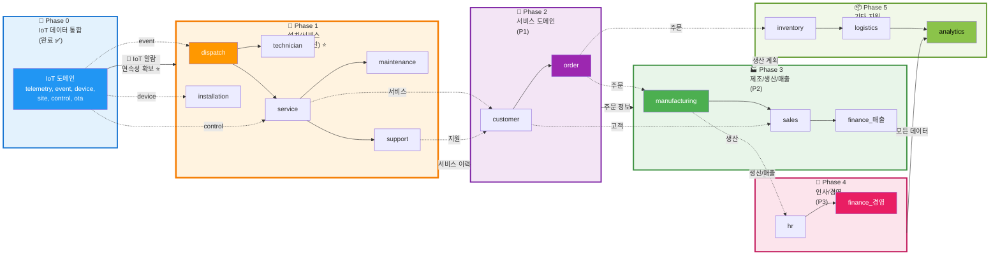
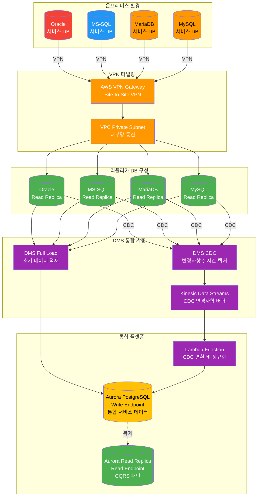
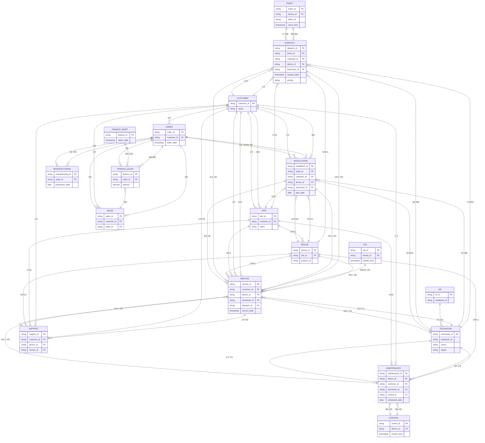
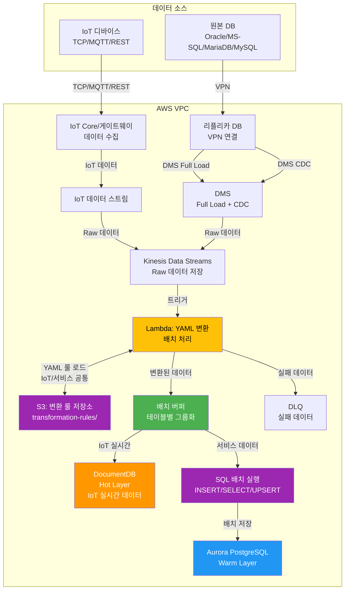
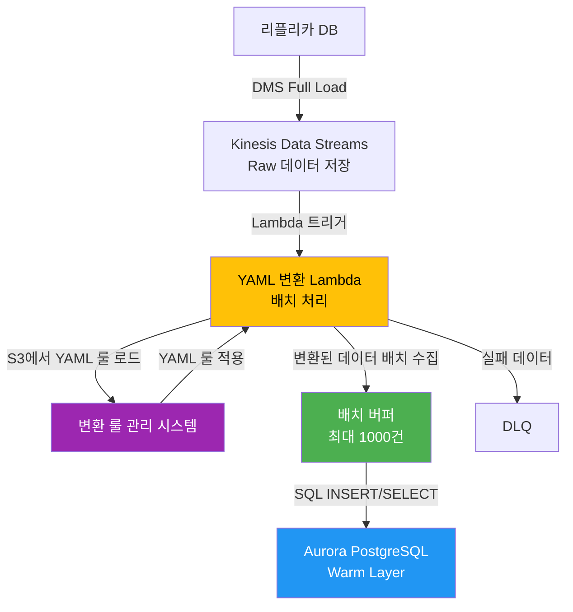
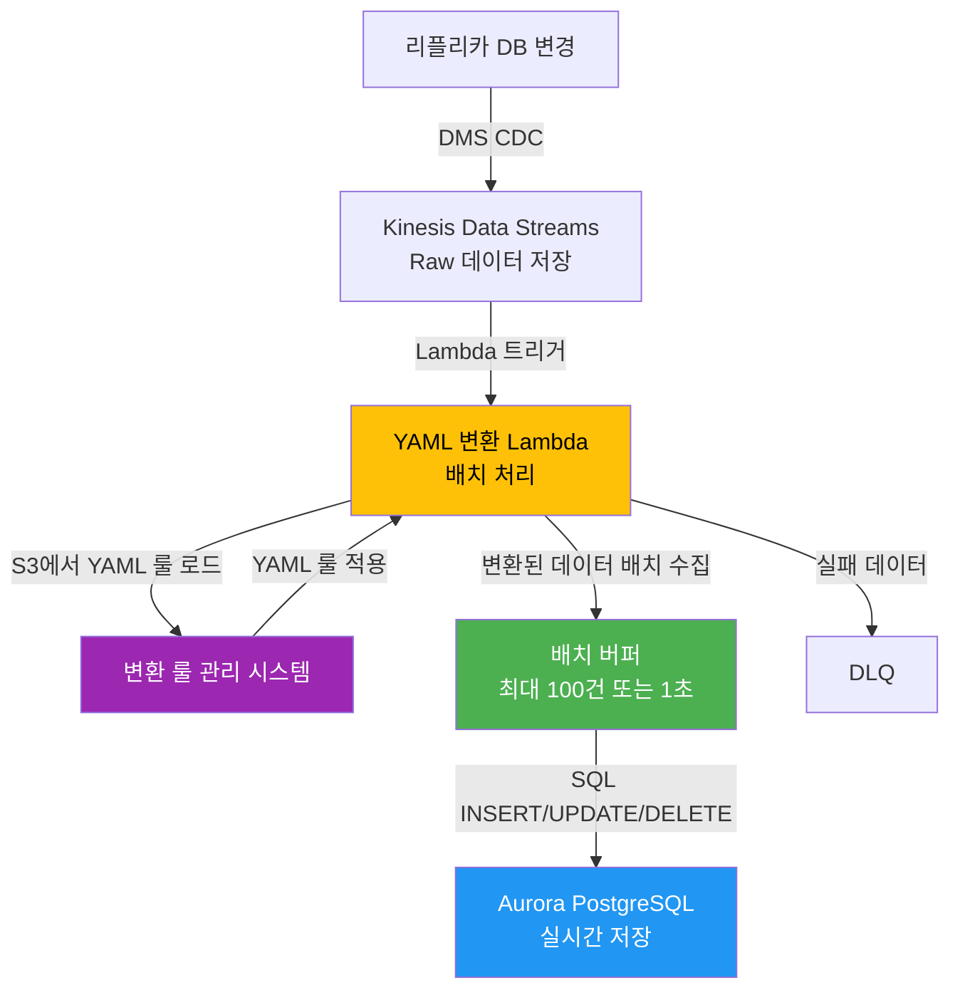
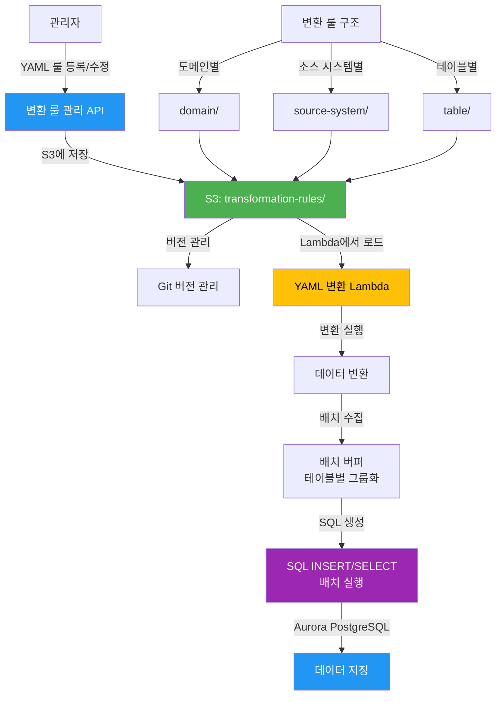

# 회사 전체 데이터 통합 기준

> **📋 문서 개요**  
> 본 문서는 현재 IoT 데이터 통합 솔루션을 기반으로 **회사 전체 데이터 통합**을 위한 기준과 전략을 정리한 설계 가이드입니다.  
> IoT 데이터 통합 아키텍처를 확장하여 모든 비즈니스 도메인의 데이터를 통합하는 방안을 제시합니다.

## 📖 문서 목적

### 현재 상태
- **IoT 데이터 통합**: 센서 데이터, 제어/상태, 펌웨어/OTA, 알람/이력 등 IoT 도메인 중심
- **7개 도메인**: telemetry, event, device, site, customer, control, ota
- **프로토콜**: TCP, MQTT, REST API
- **데이터 형식**: Hex Binary, JSON, CSV

### 목표
- **회사 전체 데이터 통합**: IoT 외 모든 비즈니스 도메인 데이터 통합
- **확장 가능한 아키텍처**: 기존 IoT 통합 아키텍처를 확장하여 모든 데이터 소스 통합
- **단일 진실원천(Single Source of Truth)**: 모든 데이터를 통합 플랫폼에서 관리

### 통합 순서 (핵심 원칙)

> **연속성 중심 통합**: IoT 데이터 통합 완료 → 설치/서비스 통합 → 고객 서비스 → 비즈니스 운영 → 경영 지원 순서

**핵심 원칙: IoT 데이터 통합 후 설치/서비스 정보를 먼저 통합하여 연속성 확보**

#### 통합 순서 및 연속성

**Phase 0: IoT 데이터 통합 (완료)**
- telemetry (센서 데이터), event (알람), device (디바이스 상태), control (제어), ota (업데이트)
- **완료 상태**: 현재 IoT 데이터 통합이 완료되어 실시간 모니터링 및 알람 발생이 가능한 상태

**Phase 1: 설치/서비스 도메인 통합 (P0 최우선)** ⭐
- **통합 도메인**: installation (설치), service (서비스 이력), technician (AS 기사), dispatch (출동), maintenance (정비), support (고객 지원/티켓)
- **연속성 확보**: 
  - IoT event (알람 발생) → dispatch (출동 요청) → technician (기사 배정) → service (서비스 처리)
  - IoT device (디바이스 상태) → installation (설치 이력) → maintenance (정비 이력)
  - IoT control (제어 이력) → service (서비스 이력) → maintenance (정비 이력)
- **통합 이유**: 
  - **IoT 데이터 통합 완료 후 즉시 필요한 단계**: 알람 발생 시 AS 기사 알림 처리 및 출동 관리가 가능해야 함
  - **연속성 확보**: IoT 알람 데이터와 직접 연계하여 실시간 AS 운영 프로세스 완성
  - **비즈니스 가치**: 현장 출동 최소화(120→18건/월), AS 처리 시간 단축(4시간→15분), 서비스 품질 향상
   
**Phase 2: 서비스 도메인 통합 (P1)**
- **통합 도메인**: customer (고객 정보), order (주문/계약 정보)
- **연속성 확보**: 
  - 설치/서비스 도메인과 연계하여 고객별 서비스 이력 관리
  - 주문 정보와 연계하여 설치 계획 수립
- **통합 이유**: AS 서비스와 고객 정보 연계, 주문 기반 설치 계획 수립

**Phase 3: 제조/생산/매출 통합 (P2)**
- **통합 도메인**: manufacturing (제조/생산), sales (영업), finance-매출 (매출/결제)
- **연속성 확보**: 서비스 도메인과 연계하여 고객별 생산/매출 분석
- **통합 이유**: 생산 효율성 향상, 매출 증대, 운영 최적화

**Phase 4: 인사/경영 통합 (P3)**
- **통합 도메인**: hr (인사), finance-경영 (경영 리포트)
- **연속성 확보**: 제조/생산 데이터와 연계하여 인건비 대비 생산성 분석
- **통합 이유**: 인사 관리 효율화, 경영 의사결정 지원

**Phase 5: 기타 지원 통합 (P4)**
- **통합 도메인**: inventory (재고), logistics (물류), analytics (분석)
- **연속성 확보**: 모든 도메인 통합 후 종합 분석
- **통합 이유**: 운영 지원, 분석 및 최적화

상세 내용은 [4. 통합 우선순위 및 전략](#4-통합-우선순위-및-전략) 및 [5. 데이터 통합 방법론 (IoT + 서비스 데이터)](#5-데이터-통합-방법론-iot--서비스-데이터) 섹션을 참고하세요.

---

## 1. 데이터 도메인 분류 기준

### 1.1 도메인 확장 전략

현재 IoT 중심 7개 도메인을 기반으로 회사 전체 비즈니스 도메인으로 확장합니다.

#### 기존 IoT 도메인 (7개)
1. **telemetry**: 시계열 센서 데이터
2. **event**: 알람/경고 이벤트
3. **device**: 디바이스 상태/설정/펌웨어
4. **site**: 사이트 정보
5. **customer**: 고객 정보
6. **control**: 제어 명령
7. **ota**: 펌웨어 업데이트

#### 확장 비즈니스 도메인 (추가)

**8. order (주문/계약)**
- 주문 정보, 계약 정보, 주문 이력
- ERP 시스템 연동
- 데이터 소스: ERP, 주문 관리 시스템

**9. inventory (재고/자산)**
- 재고 현황, 자산 정보, 입출고 이력
- 데이터 소스: WMS, 자산 관리 시스템

**10. finance (재무/회계)** - 두 가지 영역으로 구분
- **finance-매출 (P1)**: 매출 데이터, 결제 정보, 정산 데이터
  - 데이터 소스: 회계 시스템(매출 부분), 결제 시스템
  - 통합 순서: 제조/생산/매출 그룹에서 통합
- **finance-경영 (P2)**: 경영 리포트, 재무 분석, 예산 관리
  - 데이터 소스: 회계 시스템(경영 리포트 부분), 예산 관리 시스템
  - 통합 순서: 인사/경영 그룹에서 통합

**11. hr (인사/조직)**
- 직원 정보, 조직 구조, 근태, 급여
- 데이터 소스: HR 시스템, 급여 시스템

**12. sales (영업/마케팅)**
- 영업 활동, 고객 관리, 마케팅 캠페인
- 데이터 소스: CRM, 마케팅 자동화 시스템

**13. support (고객 지원)**
- 고객 문의, 티켓, 서비스 이력
- 데이터 소스: 고객 지원 시스템, 티켓 시스템

**17. installation (설치)**
- 설치 이력, 설치 계획, 설치 상태
- 데이터 소스: 설치 관리 시스템, 현장 관리 시스템
- **통합 순서**: P0 (AS/서비스 그룹)

**18. service (서비스 이력)**
- 서비스 이력, 정비 이력, 점검 이력
- 데이터 소스: 서비스 관리 시스템, 현장 관리 시스템
- **통합 순서**: P0 (AS/서비스 그룹)

**19. technician (AS 기사)**
- AS 기사 정보, 기사 스킬, 배정 이력
- 데이터 소스: 인사 시스템, AS 관리 시스템
- **통합 순서**: P0 (AS/서비스 그룹)

**20. dispatch (출동)**
- 출동 요청, 출동 이력, 출동 상태
- 데이터 소스: AS 관리 시스템, 현장 관리 시스템
- **통합 순서**: P0 (AS/서비스 그룹)

**21. maintenance (정비)**
- 정비 계획, 정비 이력, 부품 교체 이력
- 데이터 소스: 정비 관리 시스템, 자산 관리 시스템
- **통합 순서**: P0 (AS/서비스 그룹)

**14. manufacturing (제조/생산)**
- 생산 계획, 공정 정보, 품질 관리
- 데이터 소스: MES, 품질 관리 시스템

**15. logistics (물류/배송)**
- 배송 정보, 물류 추적, 창고 관리
- 데이터 소스: 물류 시스템, 배송 추적 시스템

**16. analytics (분석/리포트)**
- 비즈니스 지표, KPI, 리포트
- 데이터 소스: 분석 시스템, BI 도구

### 1.2 도메인 분류 기준

#### 기준 1: 비즈니스 프로세스 중심
- 각 도메인은 독립적인 비즈니스 프로세스를 담당
- 도메인 간 데이터 흐름이 명확히 정의됨

#### 기준 2: 데이터 소유권
- 각 도메인은 명확한 데이터 소유 조직/부서가 있음
- 데이터 변경 권한과 책임이 정의됨

#### 기준 3: 데이터 특성
- **시계열 데이터**: telemetry, event, analytics
- **마스터 데이터**: customer, site, device, hr
- **트랜잭션 데이터**: order, finance, inventory
- **이력 데이터**: support, control, ota

---

## 2. 데이터 소스 분류 기준

### 2.1 시스템 유형별 분류

#### A. 운영 시스템 (Operational Systems)
- **ERP**: 주문, 재고, 재무 데이터
- **CRM**: 영업, 고객 관리 데이터
- **HR 시스템**: 인사, 조직 데이터
- **MES**: 제조, 생산 데이터
- **WMS**: 창고, 물류 데이터

#### B. IoT/센서 시스템
- **IoT 디바이스**: 센서 데이터, 텔레메트리
- **게이트웨이**: 허브 디바이스, 차일드 디바이스
- **제어 시스템**: 원격 제어, OTA 업데이트

#### C. 분석/리포트 시스템
- **BI 도구**: 리포트, 대시보드 데이터
- **분석 플랫폼**: 예측 분석, 머신러닝 결과
- **데이터 웨어하우스**: 집계 데이터, 분석 결과

#### D. 외부 시스템
- **파트너 시스템**: 외부 API, 데이터 교환
- **클라우드 서비스**: SaaS 애플리케이션 데이터
- **소셜 미디어**: 마케팅, 고객 피드백 데이터

### 2.2 데이터 형식별 분류

#### 구조화 데이터 (Structured)
- **RDBMS**: MySQL, PostgreSQL, Oracle, MSSQL, MariaDB
- **NoSQL**: MongoDB, DynamoDB, DocumentDB
- **CSV/Excel**: 파일 기반 데이터

#### 반구조화 데이터 (Semi-structured)
- **JSON**: REST API, 웹 서비스
- **XML**: 레거시 시스템, EDI
- **YAML**: 설정 파일, 메타데이터

#### 비구조화 데이터 (Unstructured)
- **텍스트**: 로그 파일, 문서
- **이미지**: 제품 이미지, 증빙 자료
- **비디오**: 교육 자료, 프로모션 영상
- **오디오**: 고객 상담 녹음

#### 바이너리 데이터
- **Hex Binary**: IoT 센서 데이터
- **바이너리 파일**: 펌웨어, 실행 파일

### 2.3 데이터 수집 방식별 분류

#### 실시간 스트리밍
- **Kinesis Data Streams**: 실시간 데이터 스트림
- **CDC (Change Data Capture)**: 데이터베이스 변경사항 실시간 캡처
- **API Polling**: 주기적 API 호출

#### 배치 처리
- **파일 업로드**: FTP/SFTP, S3 업로드
- **스케줄 배치**: 일/주/월 단위 배치 작업
- **ETL 작업**: Glue, ECS Task, Lambda

---

## 3. 데이터 유형 분류 기준

### 3.1 데이터 특성별 분류

#### 마스터 데이터 (Master Data)
- **정의**: 비즈니스의 핵심 엔티티 정보
- **특징**: 상대적으로 변경 빈도 낮음, 여러 시스템에서 참조
- **예시**: 고객, 제품, 사이트, 직원, 조직
- **저장소**: Aurora PostgreSQL (Warm Layer, 상시 유지)
- **관리**: 데이터 품질 관리, 중복 제거, 표준화 필수

#### 트랜잭션 데이터 (Transaction Data)
- **정의**: 비즈니스 프로세스 실행 시 생성되는 데이터
- **특징**: 높은 생성 빈도, 시간 순서 중요, 변경 불가
- **예시**: 주문, 결제, 입출고, 생산 이력
- **저장소**: DocumentDB (Hot Layer, 최근 데이터), S3 + Iceberg (Cold Layer, 장기 보관)
- **관리**: 무결성 보장, 이력 추적, 감사 로그

#### 시계열 데이터 (Time Series Data)
- **정의**: 시간에 따라 변화하는 측정값
- **특징**: 시간 순서 중요, 대용량, 주기적 수집
- **예시**: 센서 데이터, 모니터링 지표, 로그
- **저장소**: DocumentDB (Hot Layer), S3 + Iceberg (Cold Layer)
- **관리**: 시간 기반 파티셔닝, 압축, 집계

#### 참조 데이터 (Reference Data)
- **정의**: 코드, 분류, 설정 정보
- **특징**: 변경 빈도 낮음, 표준화 중요
- **예시**: 국가 코드, 제품 카테고리, 알람 코드
- **저장소**: Aurora PostgreSQL (Warm Layer)
- **관리**: 버전 관리, 표준화, 검증

#### 분석 데이터 (Analytical Data)
- **정의**: 분석을 위해 가공된 데이터
- **특징**: 집계, 변환된 데이터, 쿼리 최적화
- **예시**: 일별 매출 집계, 제품별 성능 지표, 고객별 분석
- **저장소**: Aurora PostgreSQL (Warm Layer, 3년 보관), S3 + Iceberg (Cold Layer)
- **관리**: 계산식 관리, 정확성 검증, 재계산 가능

#### 메타데이터 (Metadata)
- **정의**: 데이터에 대한 정보
- **특징**: 데이터 품질, 스키마, 라인지지 정보
- **예시**: 데이터 계약서, 스키마 정의, 데이터 품질 지표
- **저장소**: Aurora PostgreSQL (Warm Layer), S3 (설정 파일)
- **관리**: 버전 관리, 문서화, 자동화

### 3.2 데이터 민감도별 분류

#### 공개 데이터 (Public)
- **정의**: 외부 공개 가능한 데이터
- **예시**: 제품 정보, 공개 리포트
- **보안**: 기본 보안 정책

#### 내부 데이터 (Internal)
- **정의**: 회사 내부에서만 사용하는 데이터
- **예시**: 운영 데이터, 내부 리포트
- **보안**: 접근 제어, 암호화 전송

#### 기밀 데이터 (Confidential)
- **정의**: 제한된 범위에서만 접근 가능
- **예시**: 고객 개인정보, 재무 데이터, 인사 정보
- **보안**: 강화된 접근 제어, 암호화 저장/전송, 감사 로그

#### 극비 데이터 (Highly Confidential)
- **정의**: 최소 권한 원칙 적용
- **예시**: 고객 신용정보, 의료 정보, 특허 정보
- **보안**: 최고 수준 보안, 마스킹, 익명화, 규정 준수

---

## 4. 통합 우선순위 및 전략

### 4.1 통합 우선순위 평가 기준

#### 기준 1: 비즈니스 가치 (Business Value)
- **높은 가치**: 핵심 비즈니스 프로세스, 고객 서비스, 수익 창출
- **중간 가치**: 운영 효율성, 비용 절감
- **낮은 가치**: 지원 기능, 참고 정보

#### 기준 2: 데이터 품질 (Data Quality)
- **높은 품질**: 표준화됨, 검증됨, 완전함
- **중간 품질**: 부분 표준화, 일부 검증 필요
- **낮은 품질**: 비표준, 검증 필요, 불완전

#### 기준 3: 기술적 복잡도 (Technical Complexity)
- **낮은 복잡도**: 표준 프로토콜, 구조화 데이터, API 제공
- **중간 복잡도**: 커스텀 프로토콜, 부분 구조화, 변환 필요
- **높은 복잡도**: 레거시 시스템, 비구조화, 대규모 마이그레이션

#### 기준 4: 데이터 볼륨 및 빈도 (Volume & Frequency)
- **대용량/고빈도**: 실시간 스트리밍, 대규모 배치
- **중간**: 주기적 배치, 중간 규모
- **소규모/저빈도**: 수동 업로드, 소규모

### 4.2 통합 우선순위 매트릭스 (비즈니스 가치 중심)

> **통합 순서 원칙**: 고객 서비스 → 비즈니스 운영 → 경영 지원 순서로 점진적 확장

| 우선순위 | 통합 그룹 | 비즈니스 가치 | 데이터 품질 | 기술 복잡도 | 데이터 볼륨 | 포함 도메인 |
|---------|---------|------------|-----------|-----------|-----------|-----------|
| **P0 (최우선)** ⭐ | **AS/서비스 도메인** | 매우 높음 | 높음 | 낮음~중간 | 중간~높음 | **installation, service, technician, dispatch, maintenance, support** |
| **P1 (높음)** | **서비스 도메인** | 높음 | 높음 | 낮음~중간 | 중간~높음 | **customer, order** |
| **P2 (중간)** | **제조/생산/매출** | 높음 | 중간~높음 | 중간 | 중간~높음 | **manufacturing, sales, finance (매출)** |
| **P3 (낮음)** | **인사/경영** | 중간~높음 | 중간 | 중간 | 중간 | **hr, finance (경영 리포트)** |
| **P4 (최하)** | **기타 지원** | 중간 | 중간 | 중간~높음 | 낮음~중간 | **inventory, logistics, analytics** |

#### 통합 그룹별 상세 설명

**P0: 설치/서비스 도메인 (IoT 연속성 확보)** ⭐
- **installation**: 설치 이력, 설치 계획, 설치 상태
- **service**: 서비스 이력, 정비 이력, 점검 이력
- **technician**: AS 기사 정보, 기사 스킬, 배정 이력
- **dispatch**: 출동 요청, 출동 이력, 출동 상태
- **maintenance**: 정비 계획, 정비 이력, 부품 교체 이력
- **support**: 고객 지원, 티켓, 서비스 문의
- **통합 이유**: 
  - **IoT 데이터 통합 완료 후 즉시 필요한 단계**: IoT 알람 발생 시 AS 처리 프로세스 완성
  - **연속성 확보**: IoT 데이터(event, device, control)와 직접 연계하여 실시간 AS 운영 프로세스 완성
  - IoT 알람 데이터와 직접 연계하여 AS 기사 알림 처리
  - 알람 발생 → 자동 대응 실패 시 → AS 기사 출동 관리
  - 현장 출동 최소화(120→18건/월), AS 처리 시간 단축(4시간→15분)
  - 서비스 품질 향상 및 고객 만족도 개선
- **IoT 연계 및 연속성**: 
  - **event (알람 발생)** → dispatch (출동 요청) → technician (기사 배정) → service (서비스 처리)
  - **device (디바이스 상태)** → installation (설치 이력) → service (서비스 이력)
  - **control (제어 이력)** → maintenance (정비 이력) → service (서비스 이력)
  - **ota (업데이트 이력)** → service (서비스 이력)

**P1: 서비스 도메인 (고객 서비스 중심)**
- **customer**: 고객 정보, 고객 관리
- **order**: 주문, 계약 정보
- **통합 이유**: AS 서비스와 고객 정보 연계, 주문 기반 설치 계획 수립

**P1: 제조/생산/매출 (비즈니스 운영 중심)**
- **manufacturing**: 생산 계획, 공정 정보, 품질 관리
- **sales**: 영업 활동, 고객 관리, 마케팅 캠페인
- **finance (매출)**: 매출 데이터, 결제, 정산
- **통합 이유**: 생산 효율성 향상, 매출 증대, 운영 최적화

**P2: 인사/경영 (경영 지원 중심)**
- **hr**: 직원 정보, 조직 구조, 근태, 급여
- **finance (경영)**: 경영 리포트, 재무 분석, 예산 관리
- **통합 이유**: 인사 관리 효율화, 경영 의사결정 지원

**P3: 기타 지원 (운영 지원)**
- **inventory**: 재고 현황, 자산 정보
- **logistics**: 배송 정보, 물류 추적
- **analytics**: 비즈니스 지표, KPI, 리포트
- **통합 이유**: 운영 지원, 분석 및 최적화

### 4.3 통합 순서 및 근거

#### 통합 순서 결정 원칙

**1. 설치/서비스 우선 (P0)** ⭐
- **이유**: IoT 데이터 통합 완료 후 즉시 필요한 단계로, 연속성 확보가 핵심
- **연속성**: 
  - IoT 데이터 통합 완료 → 설치/서비스 통합으로 실시간 AS 운영 프로세스 완성
  - IoT 알람 발생 시 즉시 AS 처리 프로세스가 작동할 수 있도록 연속성 확보
- **효과**: 
  - 현장 출동 최소화 (120→18건/월, 85% 자동 해결)
  - AS 처리 시간 단축 (4시간→15분)
  - 서비스 품질 향상 및 고객 만족도 개선
- **도메인**: installation, service, technician, dispatch, maintenance, support
- **IoT 연계 및 연속성**: 
  - **event (알람 발생)** → dispatch (출동 요청) → technician (기사 배정) → service (서비스 처리)
  - **device (디바이스 상태)** → installation (설치 이력) → service (서비스 이력)
  - **control (제어 이력)** → maintenance (정비 이력) → service (서비스 이력)
  - **ota (업데이트 이력)** → service (서비스 이력)

**2. 서비스 도메인 (P1)**
- **이유**: AS 서비스와 고객 정보 연계, 주문 기반 설치 계획 수립
- **효과**: 고객 서비스 품질 향상, 고객 만족도 개선
- **도메인**: customer, order
- **의존성**: AS/서비스 도메인과 연계하여 고객별 서비스 이력 관리

**3. 제조/생산/매출 (P2)**
- **이유**: 생산 효율성과 매출은 회사의 운영 핵심
- **효과**: 생산 최적화 → 비용 절감, 매출 증대 → 수익성 개선
- **도메인**: manufacturing, sales, finance (매출)
- **의존성**: 서비스 도메인(customer, order) 데이터와 연계하여 고객별 생산/매출 분석 가능

**4. 인사/경영 (P3)**
- **이유**: 경영 의사결정 지원 및 조직 효율성
- **효과**: 인사 관리 효율화, 경영 의사결정 데이터 제공
- **도메인**: hr, finance (경영)
- **의존성**: 제조/생산 데이터와 연계하여 인건비 대비 생산성 분석 가능

**5. 기타 지원 (P4)**
- **이유**: 운영 지원 및 분석 최적화
- **효과**: 전체 운영 효율성 향상
- **도메인**: inventory, logistics, analytics
- **의존성**: 모든 도메인 통합 후 종합 분석 가능

#### 통합 순서 다이어그램



**통합 순서 핵심 흐름**:
1. **Phase 0 → Phase 1**: IoT 알람 발생 시 즉시 AS 처리 가능하도록 연속성 확보 ⭐
   - `event` (알람) → `dispatch` (출동 요청) → `technician` (기사 배정) → `service` (서비스 처리)
2. **Phase 1 → Phase 2**: 서비스 이력과 고객 정보 연계
   - `service`, `support` → `customer` → `order`
3. **Phase 2 → Phase 3**: 주문 기반 생산 계획 및 매출 관리
   - `order` → `manufacturing` (생산 계획) → `sales` → `finance-매출`
4. **Phase 3 → Phase 4**: 생산성 분석 및 경영 의사결정 지원
   - `manufacturing` → `hr` (인건비 분석) → `finance-경영` (경영 리포트)
5. **Phase 5**: 모든 도메인 통합 후 종합 분석
   - `order` → `inventory` → `logistics` → `analytics` (종합 분석)

### 4.4 통합 전략

#### 전략 1: 점진적 통합 (IoT 운영 중심)

**통합 순서 원칙**: IoT 데이터 통합 완료 → 설치/서비스 통합 → 고객 서비스 → 비즈니스 운영 → 경영 지원

- **0단계**: IoT 데이터 통합 (현재 완료)
  - telemetry, event, device, site, customer, control, ota
  - **완료 상태**: 실시간 모니터링 및 알람 발생 가능
- **1단계**: **설치/서비스 도메인 통합** (P0) ⭐ - IoT 연속성 확보
  - **통합 이유**: IoT 데이터 통합 완료 후 즉시 필요한 단계
  - **연속성**: IoT 알람 발생 시 즉시 AS 처리 프로세스가 작동하도록 연속성 확보
  - installation (설치 이력, 설치 계획, 설치 상태)
  - service (서비스 이력, 정비 이력, 점검 이력)
  - technician (AS 기사 정보, 기사 스킬, 배정 이력)
  - dispatch (출동 요청, 출동 이력, 출동 상태)
  - maintenance (정비 계획, 정비 이력, 부품 교체 이력)
  - support (고객 지원, 티켓, 서비스 문의)
  - **IoT 연계 및 연속성**: 
    - event (알람 발생) → dispatch (출동 요청) → technician (기사 배정) → service (서비스 처리)
    - device (디바이스 상태) → installation (설치 이력) → service (서비스 이력)
    - control (제어 이력) → maintenance (정비 이력) → service (서비스 이력)
    - ota (업데이트 이력) → service (서비스 이력)
- **2단계**: **서비스 도메인 통합** (P1) - 고객 서비스 중심
  - customer (고객 정보)
  - order (주문, 계약 정보)
- **3단계**: **제조/생산/매출 통합** (P2) - 비즈니스 운영 중심
  - manufacturing (생산 계획, 공정 정보, 품질 관리)
  - sales (영업 활동, 마케팅 캠페인)
  - finance - 매출 관련 (매출 데이터, 결제, 정산)
- **4단계**: **인사/경영 통합** (P3) - 경영 지원 중심
  - hr (직원 정보, 조직 구조, 근태, 급여)
  - finance - 경영 관련 (경영 리포트, 재무 분석, 예산 관리)
- **5단계**: **기타 지원 도메인 통합** (P4) - 운영 지원
  - inventory (재고 현황, 자산 정보)
  - logistics (배송 정보, 물류 추적)
  - analytics (비즈니스 지표, KPI, 리포트)

#### 전략 2: 도메인별 독립 통합
- 각 도메인을 독립적으로 통합하여 점진적 확장
- 도메인 간 의존성 최소화
- 실패 시 다른 도메인에 영향 최소화

#### 전략 3: 데이터 레이크 우선 (Data Lake First)
- 모든 원시 데이터를 S3 Raw Layer에 먼저 수집
- 이후 필요에 따라 Standardized/Curated Layer로 변환
- 분석 요구사항 변화에 유연하게 대응

---

## 5. 데이터 통합 방법론 (IoT + 서비스 데이터)

> **📌 중요**: 본 섹션은 **IoT 데이터 통합(Phase 0)**과 **서비스 데이터 통합(Phase 1)** 모두에 적용되는 통합 방법론입니다.  
> **YAML 변환 룰**은 IoT 데이터와 서비스 데이터 모두에 동일하게 적용됩니다.

### 5.1 데이터 소스 현황

#### IoT 데이터 (Phase 0 - 완료)
- **프로토콜**: TCP, MQTT, REST API
- **데이터 형식**: Hex Binary, JSON, CSV
- **데이터 소스**: IoT 센서, 디바이스, 게이트웨이
- **통합 방식**: YAML 룰 기반 변환 (제품별 YAML 스펙)
- **저장소**: DocumentDB (Hot Layer), Aurora PostgreSQL (Warm Layer)

#### 서비스 관련 데이터 (Phase 1 - 진행 중)

#### 데이터베이스 구성
서비스 관련 데이터는 다양한 RDBMS로 구성되어 있으며, 클라우드 또는 온프레미스 환경에 분산되어 있습니다.

**지원 RDBMS**:
- **Oracle**: 엔터프라이즈급 서비스 데이터
- **MS-SQL (SQL Server)**: Windows 기반 서비스 시스템
- **MariaDB**: 오픈소스 기반 서비스 시스템
- **MySQL**: 오픈소스 기반 서비스 시스템
- **PostgreSQL**: 오픈소스 기반 서비스 시스템

**배포 환경**:
- **온프레미스**: 기존 서비스 시스템 (대부분)
- **클라우드**: 클라우드 마이그레이션된 서비스 시스템 (일부)

#### 네트워크 연결
- **VPN 터널링**: 모든 데이터 수집은 VPN을 통한 안전한 연결 필수
  - **Site-to-Site VPN**: AWS VPN Gateway를 통한 IPSec 터널
  - **VPC 내부 네트워크**: Private Subnet을 통한 내부망 통신
  - **보안**: 사설 IP 통신으로 퍼블릭 노출 없이 기존 시스템과 통신

### 5.2 리플리카 DB를 통한 연동 전략

#### 리플리카 DB 구성
서비스 관련 데이터는 리플리카 DB를 통해 연동하여 운영 시스템에 영향을 주지 않고 데이터를 수집합니다.

**리플리카 DB 전략**:
1. **읽기 전용 리플리카**: 운영 DB의 읽기 전용 복제본 생성
2. **CDC (Change Data Capture)**: 리플리카 DB에서 변경사항 실시간 캡처
3. **운영 영향 최소화**: 운영 DB에 부하를 주지 않고 데이터 수집

#### DMS (Database Migration Service) 활용

**Full Load + CDC 혼합 방식**:
- **초기 적재 (Full Load)**: 기존 데이터 전체를 한 번에 마이그레이션
- **지속 동기화 (CDC)**: 이후 변경사항은 실시간으로 동기화
- **DMS CDC**: 데이터베이스 로그(binlog/redo log/transaction log) 기반 변경사항 캡처

**DMS 지원 데이터베이스**:
- Oracle (Redo Log 기반)
- MS-SQL (Transaction Log 기반)
- MariaDB/MySQL (Binary Log 기반)
- PostgreSQL (WAL 기반)

### 5.3 데이터 통합 아키텍처

#### 통합 프로세스



### 5.4 서비스 관련 데이터 도메인 ERD

#### 전체 도메인 관계 다이어그램



#### 도메인별 주요 엔티티 및 관계

**설치/서비스 도메인 (P0 - Phase 1)** ⭐

| 엔티티 | 설명 | 주요 관계 |
|--------|------|----------|
| **dispatch** | 출동 요청, 출동 이력, 출동 상태 | event → dispatch → technician → service |
| **installation** | 설치 계획, 설치 이력, 설치 상태 | order → installation → technician → service |
| **technician** | AS 기사 정보, 기사 배정 이력 | 모든 서비스 도메인의 중심 |
| **service** | 서비스 이력, 정비 이력, 점검 이력 | 모든 서비스 활동의 결과 |
| **maintenance** | 정비 계획, 정비 이력, 부품 교체 이력 | control → maintenance → service |
| **support** | 고객 지원 티켓, 고객 문의 | service → support |

**서비스 도메인 (P1 - Phase 2)**

| 엔티티 | 설명 | 주요 관계 |
|--------|------|----------|
| **customer** | 고객 정보 | 모든 도메인의 중심 엔티티 |
| **order** | 주문/계약 정보 | customer → order → installation |
| **site** | 사이트 정보 | customer → site → device |

**제조/생산/매출 도메인 (P2 - Phase 3)**

| 엔티티 | 설명 | 주요 관계 |
|--------|------|----------|
| **manufacturing** | 생산 계획, 공정 정보 | order → manufacturing |
| **sales** | 영업 활동, 마케팅 | customer → sales → order |
| **finance_sales** | 매출 데이터, 결제 정보 | order → finance_sales |

**인사/경영 도메인 (P3 - Phase 4)**

| 엔티티 | 설명 | 주요 관계 |
|--------|------|----------|
| **hr** | 직원 정보, 조직 구조 | hr → technician |
| **finance_mgmt** | 경영 리포트, 재무 분석 | finance_mgmt → finance_sales |

#### 핵심 데이터 흐름

**1. IoT 알람 → AS 처리 흐름 (연속성 확보)** ⭐
```
event (IoT 알람 발생)
  ↓
dispatch (출동 요청)
  ↓
technician (기사 배정)
  ↓
service (서비스 처리)
  ↓
support (고객 지원, 필요시)
```

**2. 주문 → 설치 → 서비스 흐름**
```
order (주문/계약)
  ↓
installation (설치 계획)
  ↓
technician (기사 배정)
  ↓
service (설치 완료 후 서비스)
```

**3. 제어 → 정비 → 서비스 흐름**
```
control (IoT 제어 이력)
  ↓
maintenance (정비 계획)
  ↓
technician (기사 배정)
  ↓
service (정비 완료)
```

**4. 고객 중심 관계**
```
customer
  ├── site
  │   └── device
  │       ├── event (알람)
  │       ├── installation (설치)
  │       ├── service (서비스)
  │       └── maintenance (정비)
  ├── order
  │   ├── installation (설치 계획)
  │   ├── manufacturing (생산)
  │   ├── sales (영업)
  │   └── finance_sales (매출)
  ├── dispatch (출동)
  └── support (고객 지원)
```

### 5.5 공통 필드 및 표준화

#### 모든 테이블에 포함되는 공통 필드

모든 도메인 테이블에는 다음 공통 필드가 포함됩니다:

- `tenant_id`: 테넌트 식별자
- `created_by`: 등록자 (사용자 ID 또는 시스템명)
- `created_at`: 생성 시간 (UTC, ISO 8601)
- `updated_by`: 수정자 (사용자 ID 또는 시스템명)
- `updated_at`: 수정 시간 (UTC, ISO 8601)
- `source_system`: 원본 시스템 (예: 'oracle_service', 'mssql_service')
- `source_id`: 원본 시스템의 고유 ID
- `data_quality_score`: 데이터 품질 점수 (0.00-1.00)
- `sync_status`: 동기화 상태 ('synced', 'pending', 'error')
- `sync_date`: 동기화 시간

#### 데이터 표준화 규칙

**1. ID 필드 표준화**:
- 모든 ID는 `VARCHAR(50)` 또는 `VARCHAR(100)` 사용
- UUID 또는 원본 시스템 ID 유지
- 외래키 관계 명확히 정의

**2. 날짜/시간 표준화**:
- 모든 날짜/시간은 `TIMESTAMP` 타입 사용
- UTC 시간대 저장
- ISO 8601 형식 준수

**3. 상태 필드 표준화**:
- 상태 값은 ENUM 또는 VARCHAR 사용
- 상태 값 사전 정의 및 검증
- 상태 변경 이력 추적

**4. JSONB 필드 활용**:
- 유연한 구조 데이터는 JSONB 사용
- 부품 정보, 위치 정보, 메타데이터 등
- 인덱싱 및 쿼리 최적화 고려

### 5.6 데이터 통합 프로세스

#### 전체 데이터 변환 아키텍처 (IoT + 서비스 데이터 통합)



**핵심 아키텍처 원칙**:
1. **통합 변환 엔진**: IoT 데이터와 서비스 데이터 모두 **동일한 YAML 변환 룰** 사용
2. **Kinesis = Raw 데이터 저장소**: 원본 데이터를 그대로 보존 (IoT + 서비스)
3. **Lambda = 변환 엔진**: YAML 룰 기반으로 데이터 변환 (제품별/도메인별 룰)
4. **배치 버퍼 = 효율성**: 변환된 데이터를 테이블별/이벤트 타입별로 그룹화
5. **저장소 분리**: 
   - **IoT 데이터**: DocumentDB (Hot Layer) - 실시간 조회
   - **서비스 데이터**: Aurora PostgreSQL (Warm Layer) - SQL 배치 처리

#### 1단계: 데이터 수집 구성

**1.1 IoT 데이터 수집 (Phase 0 - 완료)**
- **프로토콜**: TCP, MQTT, REST API
- **수집 방식**: IoT Core 또는 게이트웨이를 통한 실시간 수집
- **데이터 형식**: Hex Binary, JSON, CSV
- **YAML 룰**: 제품별 YAML 스펙으로 변환 (예: `product-a.yaml`, `product-b.yaml`)
- **저장**: Kinesis Data Streams → Lambda 변환 → DocumentDB (Hot Layer)

**1.2 서비스 데이터 수집 (Phase 1 - 진행 중)**
1. **온프레미스 DB → 리플리카 DB 생성**
   - Oracle: Data Guard 또는 Streams
   - MS-SQL: Always On Availability Groups
   - MariaDB/MySQL: Master-Slave Replication
   - PostgreSQL: Streaming Replication

2. **VPN 연결 설정**
   - AWS VPN Gateway 구성
   - Site-to-Site VPN 터널 설정
   - VPC Private Subnet에 리플리카 DB 접근 가능하도록 설정

#### 2단계: 데이터 변환 (IoT + 서비스 공통)

**2.1 데이터 소스별 수집 및 변환**

**IoT 데이터 (Phase 0)**:
- **수집**: IoT Core/게이트웨이 → Kinesis Data Streams
- **변환**: Lambda (YAML 룰 기반, 제품별 스펙)
- **저장**: DocumentDB (Hot Layer) - 실시간 조회

**서비스 데이터 (Phase 1)**:
- **수집**: DMS (리플리카 DB) → Kinesis Data Streams
- **변환**: Lambda (YAML 룰 기반, 도메인별/테이블별 스펙)
- **저장**: Aurora PostgreSQL (Warm Layer) - SQL 배치 처리

**공통 사항**:
- **YAML 룰 저장소**: S3 (`transformation-rules/`)
- **변환 엔진**: 동일한 Lambda 함수 (yaml-transform)
- **Raw 데이터**: Kinesis Data Streams에 원본 보존

**2.2 Full Load 프로세스 (초기 데이터 마이그레이션)**



**Full Load 데이터 변환 흐름**:
1. **DMS Full Load 실행**
   - 리플리카 DB에서 전체 데이터 추출
   - 테이블별 병렬 처리
   - Kinesis Data Streams로 Raw 데이터 전송 (원본 보존)

2. **Kinesis Data Streams → Lambda 변환 (배치 처리)**
   - Kinesis Stream 이벤트로 Lambda 자동 트리거
   - 배치 단위로 처리 (최대 1000건 또는 5MB)
   - Lambda에서 소스 시스템 식별 (`source_system` 메타데이터)
   - S3에서 해당 소스 시스템의 YAML 변환 룰 로드

3. **YAML 변환 룰 적용**
   - 도메인별/테이블별 YAML 룰 파일 참조
   - 스키마 매핑, 데이터 타입 변환, 필드명 표준화
   - 데이터 품질 검증 및 보강
   - 배치 내 모든 레코드 변환

4. **변환된 데이터 배치 저장 (SQL 기반)**
   - 변환된 데이터를 배치로 모아서 처리
   - **SQL INSERT ... SELECT** 또는 **COPY** 명령 사용
   - 한 번의 SQL 실행으로 여러 레코드 일괄 삽입
   - 트랜잭션 처리로 원자성 보장
   - 성공: Aurora PostgreSQL에 저장
   - 실패: DLQ (Dead Letter Queue)로 전송 후 재처리

**2.3 CDC 프로세스 (실시간 변경사항 캡처)**



**CDC 데이터 변환 흐름**:
1. **DMS CDC 활성화**
   - 리플리카 DB 변경사항 실시간 캡처
   - 변경 이벤트 (INSERT, UPDATE, DELETE) 감지
   - Kinesis Data Streams로 Raw 데이터 실시간 전송 (원본 보존)

2. **Kinesis Data Streams → Lambda 변환 (배치 처리)**
   - Kinesis Stream 이벤트로 Lambda 자동 트리거 (실시간)
   - 배치 단위로 처리 (최대 100건 또는 1초 간격)
   - 변경 이벤트 타입 식별 (INSERT/UPDATE/DELETE)
   - 소스 시스템별 YAML 변환 룰 로드

3. **YAML 변환 룰 적용**
   - CDC 이벤트 타입별 변환 룰 적용
   - UPDATE: 변경된 필드만 변환
   - DELETE: 소프트 삭제 또는 삭제 마커 추가
   - 데이터 품질 검증 및 보강
   - 배치 내 모든 레코드 변환

4. **변환된 데이터 배치 저장 (SQL 기반)**
   - 변환된 데이터를 배치로 모아서 처리
   - **INSERT**: `INSERT INTO ... VALUES (...), (...), ...` (다중 행 삽입)
   - **UPDATE**: `UPDATE ... WHERE ...` 또는 `INSERT ... ON CONFLICT ... DO UPDATE` (UPSERT)
   - **DELETE**: `UPDATE ... SET deleted_at = NOW() WHERE ...` (소프트 삭제)
   - 한 번의 SQL 실행으로 여러 레코드 일괄 처리
   - 트랜잭션 처리로 원자성 보장
   - 성공: Aurora PostgreSQL에 실시간 저장
   - 실패: DLQ로 전송 후 재처리

#### 3단계: 데이터 변환 방식 비교 및 선택

**변환 방식 비교: YAML 변환 룰 vs SQL 직접 변환**

| 구분 | YAML 변환 룰 (통합 방식) | SQL 직접 변환 (DMS 변환 규칙) |
|------|------------------------|------------------------------|
| **변환 로직 관리** | YAML 파일로 관리 (버전 관리 용이) | DMS 변환 규칙 또는 SQL 뷰 |
| **복잡한 변환** | 분리/병합/배열 등 복잡한 변환 지원 | SQL 함수로 구현 (복잡도 증가) |
| **유지보수** | YAML 수정으로 쉽게 변경 | SQL 스크립트 수정 필요 |
| **성능** | Lambda + 배치 처리 (IoT: DocumentDB, 서비스: SQL) | DMS 직접 변환 (빠름) |
| **확장성** | 다양한 변환 케이스 지원 | SQL 제약으로 제한적 |
| **디버깅** | YAML 룰 검증 및 테스트 용이 | SQL 디버깅 복잡 |
| **적용 범위** | **모든 데이터 소스** (IoT, RDBMS, 파일, API) | RDBMS만 가능 |
| **통합성** | **IoT와 서비스 데이터 동일한 방식** | RDBMS 전용 |
| **배치 처리** | Lambda에서 배치로 모아서 처리 | DMS가 직접 처리 |

**선택 기준**:
- **YAML 변환 룰 방식 선택** (권장) ⭐:
  - **IoT와 서비스 데이터 통합**: 동일한 변환 방식으로 일관성 확보
  - 다양한 데이터 소스 지원 (IoT, RDBMS, 파일, API 등)
  - 복잡한 변환 로직 (분리/병합/배열) 필요
  - 변환 룰의 유지보수 및 버전 관리 중요
  - 확장 가능한 변환 케이스 지원
  - 제품별/도메인별 룰 관리 용이

- **SQL 직접 변환 방식** (대안):
  - 단순한 필드 매핑만 필요한 경우
  - DMS 변환 규칙으로 충분한 경우
  - 성능이 최우선인 경우
  - RDBMS 소스만 있는 경우 (IoT 데이터는 적용 불가)

**최종 선택: YAML 변환 룰 (통합 방식)** ⭐

**아키텍처 원칙**:
1. **통합 변환 엔진**: IoT 데이터와 서비스 데이터 모두 동일한 YAML 변환 룰 사용
2. **Kinesis = Raw 데이터 저장소**: 원본 데이터를 그대로 보존 (IoT + 서비스)
3. **Lambda = 변환 엔진**: YAML 룰 기반으로 데이터 변환 (제품별/도메인별 룰)
4. **저장소 분리**:
   - IoT 데이터: DocumentDB (Hot Layer) - 실시간 조회
   - 서비스 데이터: 배치 버퍼 → SQL 배치 → Aurora PostgreSQL (Warm Layer)
5. **SQL 배치 = RDBMS 최적화**: INSERT/SELECT/UPSERT로 한번에 처리 (서비스 데이터)

**왜 YAML 변환 룰인가?**:
- ✅ **통합성**: IoT 데이터와 서비스 데이터 모두 동일한 YAML 룰 구조 사용
- ✅ **YAML의 장점**: 복잡한 변환 로직 (분리/병합/배열)을 선언적으로 정의
- ✅ **제품별/도메인별 관리**: IoT는 제품별, 서비스는 도메인별로 룰 관리
- ✅ **유지보수**: YAML 룰 수정으로 변환 로직 변경 (코드 수정 불필요)
- ✅ **확장성**: 다양한 데이터 소스 (IoT, RDBMS, 파일, API)에 동일한 방식 적용 가능
- ✅ **버전 관리**: Git과 S3를 통한 룰 버전 관리 및 롤백 가능
- ✅ **SQL 배치 (서비스 데이터)**: RDBMS 네이티브 기능 활용 (다중 행 INSERT, UPSERT, COPY)

**처리 흐름 요약**:

**IoT 데이터 (Phase 0)**:
```
IoT 디바이스 (TCP/MQTT/REST)
  ↓
Kinesis Data Streams (Raw 데이터)
  ↓
YAML 룰 로드 (S3: product/ 또는 domain/telemetry/)
  ↓
데이터 변환 (Lambda: yaml-transform)
  ↓
DocumentDB (Hot Layer) - 실시간 조회
```

**서비스 데이터 (Phase 1)**:
```
리플리카 DB (RDBMS)
  ↓
DMS → Kinesis Data Streams (Raw 데이터)
  ↓
YAML 룰 로드 (S3: domain/ 또는 source-system/)
  ↓
데이터 변환 (Lambda: yaml-transform)
  ↓
배치 버퍼 (테이블별 그룹화)
  ↓
SQL 생성 및 실행 (배치 INSERT/SELECT/UPSERT)
  ↓
Aurora PostgreSQL (Warm Layer)
```

**공통 사항**:
- 동일한 Lambda 변환 함수 (`yaml-transform`)
- 동일한 YAML 룰 스키마 구조
- 동일한 S3 룰 저장소 (`transformation-rules/`)

**3.1 변환 룰 관리 및 SQL 배치 처리 아키텍처**



**핵심 원리**:
1. **통합 YAML 변환 룰**: IoT 데이터와 서비스 데이터 모두 동일한 YAML 룰 구조 사용
2. **Kinesis는 Raw 데이터 저장**: 원본 데이터를 그대로 보존 (IoT + 서비스)
3. **Lambda에서 YAML 룰로 변환**: 
   - IoT 데이터: 제품별 YAML 스펙으로 변환
   - 서비스 데이터: 도메인별/테이블별 YAML 룰로 변환
4. **저장소 분리**:
   - IoT 데이터: DocumentDB (Hot Layer) - 실시간 조회
   - 서비스 데이터: 배치로 모아서 SQL로 한번에 저장 → Aurora PostgreSQL
5. **RDBMS 최적화**: INSERT/SELECT, UPSERT, COPY 등 RDBMS 네이티브 기능 활용

**3.2 변환 룰 저장 구조**

```
s3://data-integration/transformation-rules/
├── product/                    # IoT 제품별 YAML 룰 (Phase 0)
│   ├── product-a/
│   │   ├── v1.0.0.yaml
│   │   └── v1.1.0.yaml
│   ├── product-b/
│   │   └── v1.0.0.yaml
│   └── product-c/
│       └── v1.0.0.yaml
├── domain/                     # 서비스 도메인별 YAML 룰 (Phase 1)
│   ├── installation/
│   │   ├── v1.0.0.yaml
│   │   └── v1.1.0.yaml
│   ├── dispatch/
│   │   └── v1.0.0.yaml
│   ├── service/
│   │   └── v1.0.0.yaml
│   ├── telemetry/              # IoT 도메인 (Phase 0)
│   │   └── v1.0.0.yaml
│   ├── event/                  # IoT 도메인 (Phase 0)
│   │   └── v1.0.0.yaml
│   └── device/                 # IoT 도메인 (Phase 0)
│       └── v1.0.0.yaml
├── source-system/
│   ├── iot_gateway/            # IoT 소스 시스템
│   │   ├── telemetry.yaml
│   │   ├── event.yaml
│   │   └── device.yaml
│   ├── oracle_service/         # 서비스 소스 시스템
│   │   ├── dispatch_requests.yaml
│   │   └── technicians.yaml
│   ├── mssql_service/
│   │   ├── installation_plans.yaml
│   │   └── service_history.yaml
│   └── mariadb_service/
│       └── maintenance_plans.yaml
└── table/
    ├── dispatch_requests/
    │   ├── oracle_service.yaml
    │   └── mssql_service.yaml
    └── technicians/
        └── oracle_service.yaml
```

**YAML 룰 적용 범위**:
- **IoT 데이터 (Phase 0)**: 제품별/도메인별 YAML 룰 (`product/`, `domain/telemetry/`, `domain/event/`, `domain/device/`)
- **서비스 데이터 (Phase 1)**: 도메인별/소스 시스템별 YAML 룰 (`domain/installation/`, `source-system/oracle_service/`)
- **공통**: 동일한 Lambda 변환 함수, 동일한 YAML 스키마 구조

**3.3 소스 데이터 형식 파악 및 스키마 분석**

**소스 데이터 형식 파악 프로세스**:
1. **스키마 자동 분석**
   - DMS를 통한 소스 DB 스키마 자동 추출
   - 테이블 구조, 컬럼 타입, 제약조건 파악
   - 외래키 관계 분석

2. **데이터 샘플링**
   - 소스 데이터 샘플 추출 (최대 1000건)
   - 실제 데이터 형식 및 패턴 분석
   - NULL 값 비율, 중복도, 데이터 분포 분석

3. **스키마 문서화**
   - 소스 시스템별 스키마 문서 생성
   - YAML 변환 룰 작성 시 참조
   - 버전 관리 및 변경 이력 추적

**스키마 분석 결과 예시**:
```yaml
# s3://transformation-rules/source-system/oracle_service/schema/dispatch_requests.yaml
source_system: "oracle_service"
table: "AS_DISPATCH_REQ"
analyzed_at: "2026-01-25T10:00:00Z"

schema:
  columns:
    - name: "REQ_ID"
      type: "VARCHAR2(50)"
      nullable: false
      primary_key: true
      sample_values: ["REQ-20260101", "REQ-20260102"]
      
    - name: "CUST_CODE"
      type: "VARCHAR2(50)"
      nullable: false
      foreign_key: "CUSTOMERS.CUST_CODE"
      sample_values: ["CUST001", "CUST002"]
      
    - name: "FULL_ADDRESS"
      type: "VARCHAR2(500)"
      nullable: true
      pattern: "시도 시군구 상세주소"  # 분리 가능
      sample_values: ["서울특별시 강남구 테헤란로 123", "부산광역시 해운대구 해운대해변로 456"]
      
    - name: "CONTACT_INFO"
      type: "VARCHAR2(200)"
      nullable: true
      pattern: "JSON"  # JSON 배열로 처리 가능
      sample_values: ['{"phone":"010-1234-5678","email":"test@example.com"}']
      
    - name: "PARTS_LIST"
      type: "CLOB"
      nullable: true
      pattern: "CSV"  # CSV 배열로 처리 가능
      sample_values: ["PART001,PART002,PART003", "PART004,PART005"]
      
    - name: "SKILLS"
      type: "VARCHAR2(1000)"
      nullable: true
      pattern: "PIPE_DELIMITED"  # 파이프 구분자 배열
      sample_values: ["전기|냉난방|설비", "전기|냉난방"]
      
    - name: "REQ_DATE"
      type: "DATE"
      nullable: false
      format: "YYYY-MM-DD HH24:MI:SS"
      timezone: "Asia/Seoul"
      
    - name: "FIRST_NAME"
      type: "VARCHAR2(50)"
      nullable: true
      
    - name: "LAST_NAME"
      type: "VARCHAR2(50)"
      nullable: true
      # FIRST_NAME + LAST_NAME → full_name으로 병합 가능

data_characteristics:
  total_rows: 100000
  null_rates:
    REQ_ID: 0.0
    CUST_CODE: 0.0
    FULL_ADDRESS: 0.15
    CONTACT_INFO: 0.05
  unique_values:
    REQ_ID: 100000
    CUST_CODE: 5000
  data_distribution:
    REQ_TYPE:
      URGENT: 0.10
      NORMAL: 0.85
      RESERVED: 0.05
```

**3.4 YAML 변환 룰 스키마 예시**

**예시 1: 소스 시스템별 테이블 매핑 룰 (기본)**

```yaml
# s3://transformation-rules/source-system/oracle_service/dispatch_requests.yaml
version: "1.0.0"
source_system: "oracle_service"
domain: "dispatch"
table: "dispatch_requests"
enabled: true

# 스키마 매핑
schema_mapping:
  source_table: "AS_DISPATCH_REQ"
  target_table: "dispatch_requests"
  
# 필드 매핑
field_mapping:
  - source: "REQ_ID"
    target: "request_id"
    type: "VARCHAR(50)"
    required: true
    
  - source: "CUST_CODE"
    target: "customer_id"
    type: "VARCHAR(50)"
    required: true
    lookup:
      table: "customers"
      key: "customer_code"
      
  - source: "SITE_CODE"
    target: "site_id"
    type: "VARCHAR(50)"
    required: true
    lookup:
      table: "sites"
      key: "site_code"
      
  - source: "DEVICE_CODE"
    target: "device_id"
    type: "VARCHAR(50)"
    required: false
    
  - source: "ALARM_ID"
    target: "alarm_id"
    type: "VARCHAR(100)"
    required: false
    
  - source: "REQ_TYPE"
    target: "request_type"
    type: "VARCHAR(50)"
    transform:
      type: "enum"
      mapping:
        "URGENT": "긴급"
        "NORMAL": "일반"
        "RESERVED": "예약"
        
  - source: "PRIORITY"
    target: "priority"
    type: "VARCHAR(20)"
    transform:
      type: "uppercase"
      
  - source: "REQ_DATE"
    target: "request_date"
    type: "TIMESTAMP"
    transform:
      type: "datetime"
      source_format: "YYYY-MM-DD HH24:MI:SS"
      target_format: "ISO8601"
      timezone: "Asia/Seoul"
      convert_to_utc: true
      
  - source: "REQ_BY"
    target: "requested_by"
    type: "VARCHAR(100)"
    
  - source: "DESCRIPTION"
    target: "description"
    type: "TEXT"
    
  - source: "STATUS"
    target: "status"
    type: "VARCHAR(20)"
    transform:
      type: "enum"
      mapping:
        "REQUESTED": "요청"
        "ASSIGNED": "배정"
        "DISPATCHED": "출동"
        "COMPLETED": "완료"
        "CANCELLED": "취소"
        
  - source: "TECH_ID"
    target: "technician_id"
    type: "VARCHAR(50)"
    required: false
    lookup:
      table: "technicians"
      key: "technician_code"
      
  - source: "DISPATCH_DATE"
    target: "dispatch_date"
    type: "TIMESTAMP"
    required: false
    transform:
      type: "datetime"
      source_format: "YYYY-MM-DD HH24:MI:SS"
      target_format: "ISO8601"
      convert_to_utc: true
      
  - source: "COMPLETE_DATE"
    target: "completion_date"
    type: "TIMESTAMP"
    required: false
    transform:
      type: "datetime"
      source_format: "YYYY-MM-DD HH24:MI:SS"
      target_format: "ISO8601"
      convert_to_utc: true

# 공통 필드 자동 추가
common_fields:
  - name: "created_by"
    value: "system"
    type: "VARCHAR(100)"
    
  - name: "created_at"
    value: "NOW()"
    type: "TIMESTAMP"
    
  - name: "updated_by"
    value: "system"
    type: "VARCHAR(100)"
    
  - name: "updated_at"
    value: "NOW()"
    type: "TIMESTAMP"
    
  - name: "source_system"
    value: "oracle_service"
    type: "VARCHAR(50)"
    
  - name: "source_id"
    value: "${REQ_ID}"
    type: "VARCHAR(100)"
    
  - name: "tenant_id"
    value: "${TENANT_ID}"
    type: "VARCHAR(50)"
    required: true

# 데이터 품질 검증 규칙
data_quality:
  - field: "request_id"
    rules:
      - type: "not_null"
      - type: "unique"
      - type: "format"
        pattern: "^REQ-[0-9]{8}$"
        
  - field: "customer_id"
    rules:
      - type: "not_null"
      - type: "foreign_key"
        table: "customers"
        key: "customer_id"
        
  - field: "request_date"
    rules:
      - type: "not_null"
      - type: "date_range"
        min: "2020-01-01"
        max: "NOW()"
        
  - field: "priority"
    rules:
      - type: "enum"
        values: ["Critical", "High", "Medium", "Low"]

# CDC 이벤트 타입별 처리
cdc_handling:
  INSERT:
    action: "insert"
    validate: true
    
  UPDATE:
    action: "upsert"
    key: "source_system + source_id"
    validate: true
    
  DELETE:
    action: "soft_delete"
    field: "deleted_at"
    value: "NOW()"
    # 또는 완전 삭제
    # action: "hard_delete"

# 데이터 보강 규칙
enrichment:
  - type: "lookup"
    source_field: "customer_id"
    target_table: "customers"
    target_key: "customer_id"
    enrich_fields:
      - "customer_name"
      - "customer_type"
      
  - type: "lookup"
    source_field: "site_id"
    target_table: "sites"
    target_key: "site_id"
    enrich_fields:
      - "site_name"
      - "site_address"
```

**예시 2: 소스 데이터 분리 (Split) 변환**

```yaml
# s3://transformation-rules/source-system/oracle_service/dispatch_requests.yaml
version: "1.0.0"
source_system: "oracle_service"
domain: "dispatch"
table: "dispatch_requests"

field_mapping:
  # 케이스 1: 주소 필드를 여러 필드로 분리
  - source: "FULL_ADDRESS"  # 소스 필드명 (필수)
    # target은 split 변환의 경우 parts 안에 정의됨
    transform:
      type: "split"
      separator: " "  # 공백으로 분리
      parts:
        - source_index: 0  # 소스 배열 인덱스
          target: "address_sido"  # 타겟 필드명 (필수)
          type: "VARCHAR(50)"
          pattern: "^[가-힣]+(시|도|특별시|광역시)$"
        - source_index: 1  # 소스 배열 인덱스
          target: "address_sigungu"  # 타겟 필드명 (필수)
          type: "VARCHAR(50)"
          pattern: "^[가-힣]+(구|군|시)$"
        - source_index: 2  # 소스 배열 인덱스
          target: "address_detail"  # 타겟 필드명 (필수)
          type: "VARCHAR(200)"
          # 나머지 부분을 모두 포함
          join_remaining: true
    # 원본 필드도 유지하려면 별도로 정의
    # - source: "FULL_ADDRESS"
    #   target: "address"
    #   type: "TEXT"
    # 또는 정규식으로 분리
    # transform:
    #   type: "split_regex"
    #   pattern: "^([가-힣]+(시|도|특별시|광역시))\\s+([가-힣]+(구|군|시))\\s+(.+)$"
    #   groups:
    #     - target: "address_sido"
    #     - target: "address_sigungu"
    #     - target: "address_detail"
  
  # 케이스 2: 이름 필드를 성과 이름으로 분리
  - source: "FULL_NAME"  # 소스 필드명 (필수)
    transform:
      type: "split"
      separator: " "
      parts:
        - source_index: 0  # 소스 배열 인덱스
          target: "last_name"  # 타겟 필드명 (필수)
          type: "VARCHAR(50)"
        - source_index: 1  # 소스 배열 인덱스
          target: "first_name"  # 타겟 필드명 (필수)
          type: "VARCHAR(50)"
          join_remaining: true  # 중간 이름 등이 있는 경우
  
  # 케이스 3: 날짜/시간 필드를 날짜와 시간으로 분리
  - source: "REQ_DATETIME"  # 소스 필드명 (필수)
    transform:
      type: "split_datetime"
      source_format: "YYYY-MM-DD HH24:MI:SS"
      parts:
        - target: "request_date"  # 타겟 필드명 (필수)
          type: "DATE"
        - target: "request_time"  # 타겟 필드명 (필수)
          type: "TIME"
  
  # 케이스 4: 복합 필드를 여러 필드로 분리 (예: "품목1:수량1,품목2:수량2")
  - source: "ITEMS_QUANTITY"  # 소스 필드명 (필수)
    target: "items"  # 타겟 필드명 (배열로 저장할 경우, 필수)
    type: "JSONB"
    transform:
      type: "split_nested"
      outer_separator: ","  # 외부 구분자
      inner_separator: ":"  # 내부 구분자
      parts:
        - source_index: 0  # 소스 배열 인덱스
          target_key: "item_name"  # 타겟 객체 키 (필수)
          type: "VARCHAR(100)"
        - source_index: 1  # 소스 배열 인덱스
          target_key: "item_quantity"  # 타겟 객체 키 (필수)
          type: "INTEGER"
      # 결과: 배열로 저장 (JSONB)
      output_type: "array"
```

**예시 3: 여러 컬럼 병합 (Merge) 변환**

```yaml
# s3://transformation-rules/source-system/mssql_service/technicians.yaml
version: "1.0.0"
source_system: "mssql_service"
domain: "technician"
table: "technicians"

field_mapping:
  # 케이스 1: 이름 필드들을 하나로 병합
  - sources: ["FIRST_NAME", "LAST_NAME"]  # 소스 필드명 배열 (필수)
    target: "full_name"  # 타겟 필드명 (필수)
    type: "VARCHAR(100)"
    transform:
      type: "merge"
      separator: " "  # 공백으로 연결
      format: "{LAST_NAME} {FIRST_NAME}"  # 또는 포맷 지정
      # null 처리
      skip_null: true  # null 값은 건너뛰기
      # 예: "홍" + "길동" → "홍 길동" 또는 "길동 홍"
  
  # 케이스 2: 주소 필드들을 하나로 병합
  - sources: ["ADDR_SIDO", "ADDR_SIGUNGU", "ADDR_DETAIL"]  # 소스 필드명 배열 (필수)
    target: "full_address"  # 타겟 필드명 (필수)
    type: "VARCHAR(500)"
    transform:
      type: "merge"
      separator: " "
      format: "{ADDR_SIDO} {ADDR_SIGUNGU} {ADDR_DETAIL}"
      skip_null: true
  
  # 케이스 3: 날짜와 시간을 하나의 타임스탬프로 병합
  - sources: ["REQ_DATE", "REQ_TIME"]  # 소스 필드명 배열 (필수)
    target: "request_datetime"  # 타겟 필드명 (필수)
    type: "TIMESTAMP"
    transform:
      type: "merge_datetime"
      source_date_field: "REQ_DATE"  # 소스 날짜 필드명
      source_time_field: "REQ_TIME"  # 소스 시간 필드명
      date_format: "YYYY-MM-DD"
      time_format: "HH24:MI:SS"
      timezone: "Asia/Seoul"
      convert_to_utc: true
  
  # 케이스 4: 여러 필드를 JSON 객체로 병합
  - sources: ["PHONE", "EMAIL", "MOBILE"]  # 소스 필드명 배열 (필수)
    target: "contact_info"  # 타겟 필드명 (필수)
    type: "JSONB"
    transform:
      type: "merge_json"
      # 소스 필드명 → 타겟 키 매핑
      field_mapping:
        - source: "PHONE"  # 소스 필드명 (필수)
          target_key: "phone"  # 타겟 JSON 키 (필수)
        - source: "EMAIL"  # 소스 필드명 (필수)
          target_key: "email"  # 타겟 JSON 키 (필수)
        - source: "MOBILE"  # 소스 필드명 (필수)
          target_key: "mobile"  # 타겟 JSON 키 (필수)
      # 결과: {"phone": "010-1234-5678", "email": "test@example.com", "mobile": "010-9876-5432"}
  
  # 케이스 5: 여러 필드를 배열로 병합
  - sources: ["SKILL_1", "SKILL_2", "SKILL_3"]  # 소스 필드명 배열 (필수)
    target: "skills"  # 타겟 필드명 (필수)
    type: "JSONB"  # PostgreSQL JSONB 배열
    transform:
      type: "merge_array"
      # null 값 제외
      filter_null: true
      # 중복 제거
      unique: true
      # 정렬
      sort: true
```

**예시 4: 배열 처리 (Array) 변환**

```yaml
# s3://transformation-rules/source-system/oracle_service/technicians.yaml
version: "1.0.0"
source_system: "oracle_service"
domain: "technician"
table: "technicians"

field_mapping:
  # 케이스 1: CSV 형식 문자열을 배열로 변환
  - source: "PARTS_LIST"
    target: "parts"
    type: "JSONB"
    transform:
      type: "array_from_csv"
      separator: ","
      # 각 요소 변환
      item_transform:
        type: "trim"  # 공백 제거
      # 필터링
      filter:
        - type: "not_empty"  # 빈 문자열 제거
      # 결과: ["PART001", "PART002", "PART003"]
  
  # 케이스 2: 파이프 구분자 문자열을 배열로 변환
  - source: "SKILLS"
    target: "skills"
    type: "JSONB"
    transform:
      type: "array_from_delimited"
      separator: "|"
      item_transform:
        type: "trim"
      unique: true  # 중복 제거
      # 결과: ["전기", "냉난방", "설비"]
  
  # 케이스 3: JSON 문자열을 배열로 변환
  - source: "CONTACT_INFO"
    target: "contacts"
    type: "JSONB"
    transform:
      type: "array_from_json"
      # JSON 문자열 파싱
      json_path: "$.contacts"  # JSONPath로 배열 추출
      # 또는 전체가 배열인 경우
      # json_path: "$"
      # 결과: [{"type": "phone", "value": "010-1234-5678"}, {"type": "email", "value": "test@example.com"}]
  
  # 케이스 4: 배열을 여러 행으로 확장 (Normalize)
  - source: "PARTS_LIST"
    target: "parts"
    type: "JSONB"
    transform:
      type: "array_from_csv"
      separator: ","
    # 별도 테이블로 정규화 (1:N 관계)
    normalize:
      target_table: "technician_parts"
      foreign_key: "technician_id"
      value_field: "part_id"
      # 원본 레코드의 다른 필드도 함께 복사
      copy_fields:
        - "technician_id"
        - "created_at"
  
  # 케이스 5: 배열 요소 변환 및 필터링
  - source: "CERTIFICATIONS"
    target: "certifications"
    type: "JSONB"
    transform:
      type: "array_from_json"
      json_path: "$"
      # 각 요소 변환
      item_transform:
        type: "object_map"
        mapping:
          cert_name: "name"
          cert_date: "date"
          cert_expiry: "expiry"
          cert_org: "organization"
      # 필터링 (만료되지 않은 자격증만)
      filter:
        - type: "expression"
          condition: "item.expiry > NOW()"
      # 정렬
      sort:
        field: "date"
        order: "desc"
  
  # 케이스 6: 배열을 문자열로 변환 (역변환)
  - source: "SKILLS_ARRAY"  # JSONB 배열
    target: "skills_string"
    type: "VARCHAR(1000)"
    transform:
      type: "array_to_string"
      separator: "|"
      # 각 요소 변환
      item_transform:
        type: "trim"
      # 결과: "전기|냉난방|설비"
  
  # 케이스 7: 배열을 여러 개의 개별 컬럼으로 분리
  - source: "SKILLS_ARRAY"  # 소스 필드명 (필수) - ["전기", "냉난방", "설비"]
    transform:
      type: "array_to_columns"
      # 배열의 각 인덱스를 개별 컬럼으로 매핑
      columns:
        - source_index: 0  # 소스 배열 인덱스 (필수)
          target: "primary_skill"  # 타겟 필드명 (필수)
          type: "VARCHAR(50)"
          required: false  # 배열이 비어있을 수 있음
        - source_index: 1  # 소스 배열 인덱스 (필수)
          target: "secondary_skill"  # 타겟 필드명 (필수)
          type: "VARCHAR(50)"
          required: false
        - source_index: 2  # 소스 배열 인덱스 (필수)
          target: "tertiary_skill"  # 타겟 필드명 (필수)
          type: "VARCHAR(50)"
          required: false
      # 배열 길이가 부족한 경우 null 처리
      default_null: true
      # 결과: {primary_skill: "전기", secondary_skill: "냉난방", tertiary_skill: "설비"}
  
  # 케이스 8: 배열을 하나의 컬럼으로 변환 (JSONB 배열 유지)
  - source: "SKILLS_ARRAY"  # ["전기", "냉난방", "설비"]
    target: "skills"
    type: "JSONB"
    transform:
      type: "array_as_is"
      # 배열을 그대로 JSONB로 저장
      # 필터링/정렬 옵션
      filter:
        - type: "not_empty"
      unique: true
      sort: true
      # 결과: ["전기", "냉난방", "설비"] (JSONB)
  
  # 케이스 9: 배열을 하나의 문자열 컬럼으로 변환 (구분자 사용)
  - source: "SKILLS_ARRAY"  # ["전기", "냉난방", "설비"]
    target: "skills_concatenated"
    type: "VARCHAR(1000)"
    transform:
      type: "array_to_string"
      separator: ", "  # 쉼표와 공백으로 연결
      item_transform:
        type: "trim"
      # 결과: "전기, 냉난방, 설비"
  
  # 케이스 10: 배열의 특정 인덱스만 개별 컬럼으로 추출
  - source: "CONTACT_ARRAY"  # 소스 필드명 (필수) - [{"type": "phone", "value": "010-1234-5678"}, {"type": "email", "value": "test@example.com"}]
    transform:
      type: "array_to_columns_by_key"
      # 배열의 객체에서 특정 키 값으로 컬럼 매핑
      source_key_field: "type"  # 소스 객체의 키 필드명 (필수)
      source_value_field: "value"  # 소스 객체의 값 필드명 (필수)
      columns:
        - source_key_value: "phone"  # 소스 키 값 (필수)
          target: "phone_number"  # 타겟 필드명 (필수)
          type: "VARCHAR(20)"
        - source_key_value: "email"  # 소스 키 값 (필수)
          target: "email_address"  # 타겟 필드명 (필수)
          type: "VARCHAR(100)"
        - source_key_value: "mobile"  # 소스 키 값 (필수)
          target: "mobile_number"  # 타겟 필드명 (필수)
          type: "VARCHAR(20)"
      # 결과: {phone_number: "010-1234-5678", email_address: "test@example.com", mobile_number: null}
  
  # 케이스 11: 배열을 여러 컬럼으로 분리 + 나머지는 배열로 유지
  - source: "PARTS_ARRAY"  # 소스 필드명 (필수) - ["PART001", "PART002", "PART003", "PART004", "PART005"]
    transform:
      type: "array_split_columns"
      # 처음 N개는 개별 컬럼으로, 나머지는 배열로
      split_at: 3  # 처음 3개만 개별 컬럼으로
      columns:
        - source_index: 0  # 소스 배열 인덱스 (필수)
          target: "part_1"  # 타겟 필드명 (필수)
          type: "VARCHAR(50)"
        - source_index: 1  # 소스 배열 인덱스 (필수)
          target: "part_2"  # 타겟 필드명 (필수)
          type: "VARCHAR(50)"
        - source_index: 2  # 소스 배열 인덱스 (필수)
          target: "part_3"  # 타겟 필드명 (필수)
          type: "VARCHAR(50)"
      # 나머지는 배열로 저장
      remaining_target: "parts_remaining"  # 나머지 배열의 타겟 필드명 (필수)
      remaining_type: "JSONB"
      # 결과: {part_1: "PART001", part_2: "PART002", part_3: "PART003", parts_remaining: ["PART004", "PART005"]}
```

**예시 5: 복합 변환 (분리 + 병합 + 배열)**

```yaml
# s3://transformation-rules/source-system/oracle_service/service_history.yaml
version: "1.0.0"
source_system: "oracle_service"
domain: "service"
table: "service_history"

field_mapping:
  # 케이스 1: 복합 주소 필드 분리 후 재구성
  - source: "FULL_ADDRESS"  # 소스 필드명 (필수)
    transform:
      type: "split"
      separator: " "
      parts:
        - source_index: 0  # 소스 배열 인덱스 (필수)
          target: "address_sido"  # 타겟 필드명 (필수)
        - source_index: 1  # 소스 배열 인덱스 (필수)
          target: "address_sigungu"  # 타겟 필드명 (필수)
        - source_index: 2  # 소스 배열 인덱스 (필수)
          target: "address_detail"  # 타겟 필드명 (필수)
          join_remaining: true
  # 분리된 필드들을 다시 표준 형식으로 병합
  - sources: ["address_sido", "address_sigungu", "address_detail"]  # 소스 필드명 배열 (필수)
    target: "standardized_address"  # 타겟 필드명 (필수)
    type: "VARCHAR(500)"
    transform:
      type: "merge"
      separator: " "
      format: "{address_sido} {address_sigungu} {address_detail}"
  
  # 케이스 2: 부품 정보를 배열로 변환 후 정규화
  - source: "PARTS_INFO"  # "PART001:10,PART002:5,PART003:2"
    target: "parts"
    type: "JSONB"
    transform:
      type: "array_from_nested"
      outer_separator: ","
      inner_separator: ":"
      item_transform:
        type: "object_map"
        mapping:
          part_id: 0
          quantity: 1
          quantity_type: "integer"
      # 결과: [{"part_id": "PART001", "quantity": 10}, {"part_id": "PART002", "quantity": 5}]
    # 별도 테이블로 정규화
    normalize:
      target_table: "service_parts"
      foreign_key: "service_id"
      value_fields:
        - "part_id"
        - "quantity"
  
  # 케이스 3: 여러 필드를 하나의 JSON 객체로 병합
  - sources: ["CUSTOMER_CODE", "CUSTOMER_NAME", "CUSTOMER_TYPE"]  # 소스 필드명 배열 (필수)
    target: "customer_info"  # 타겟 필드명 (필수)
    type: "JSONB"
    transform:
      type: "merge_json"
      # 소스 필드명 → 타겟 키 매핑
      field_mapping:
        - source: "CUSTOMER_CODE"  # 소스 필드명 (필수)
          target_key: "customer_id"  # 타겟 JSON 키 (필수)
        - source: "CUSTOMER_NAME"  # 소스 필드명 (필수)
          target_key: "name"  # 타겟 JSON 키 (필수)
        - source: "CUSTOMER_TYPE"  # 소스 필드명 (필수)
          target_key: "type"  # 타겟 JSON 키 (필수)
      # 결과: {"customer_id": "CUST001", "name": "삼성전자", "type": "기업"}
```

**예시 6: 도메인별 공통 변환 룰**

```yaml
# s3://transformation-rules/domain/dispatch/common.yaml
version: "1.0.0"
domain: "dispatch"
type: "common"

# 도메인 공통 필드 매핑
common_field_mapping:
  - source_pattern: "*_ID"
    target_suffix: "_id"
    type: "VARCHAR(50)"
    
  - source_pattern: "*_DATE"
    target_suffix: "_date"
    type: "TIMESTAMP"
    transform:
      type: "datetime"
      convert_to_utc: true
      
  - source_pattern: "*_BY"
    target_suffix: "_by"
    type: "VARCHAR(100)"
    
  - source_pattern: "*_STATUS"
    target_suffix: "_status"
    type: "VARCHAR(20)"

# 도메인 공통 데이터 품질 규칙
common_quality_rules:
  - field_pattern: "*_id"
    rules:
      - type: "not_null"
      - type: "format"
        pattern: "^[A-Z0-9-]+$"
        
  - field_pattern: "*_date"
    rules:
      - type: "not_null"
      - type: "date_range"
        min: "2020-01-01"
```

**3.5 변환 룰 등록/관리 프로세스**

**1. 변환 룰 등록**
- 관리자 또는 데이터 엔지니어가 YAML 파일 작성
- 변환 룰 관리 API를 통해 S3에 업로드
- Git에 버전 관리 (변경 이력 추적)
- 변환 룰 검증 (스키마 검증, 문법 검증)

**2. 변환 룰 버전 관리**
- 버전 형식: `v{major}.{minor}.{patch}` (예: `v1.0.0`)
- 주요 변경사항: major 버전 증가
- 호환 가능한 변경: minor 버전 증가
- 버그 수정: patch 버전 증가
- 이전 버전 호환성 유지 (롤백 가능)

**3. 변환 룰 적용**
- Lambda 실행 시 S3에서 최신 버전의 YAML 룰 로드
- 캐싱: Lambda 환경 변수 또는 Parameter Store에 캐시
- 룰 변경 시 Lambda 재시작 또는 캐시 무효화

**4. 변환 룰 모니터링**
- 변환 성공/실패율 추적
- 변환 룰별 처리 시간 모니터링
- 데이터 품질 점수 추적
- 변환 룰 오류 알림

**5. SQL 배치 처리 최적화**
- 배치 크기 조정: Full Load (1000건), CDC (100건)
- 배치 타임아웃: Full Load (5초), CDC (1초)
- SQL 실행 최적화: 다중 행 INSERT, UPSERT, COPY 명령 활용
- 트랜잭션 관리: 배치 단위 트랜잭션으로 원자성 보장
- 연결 풀링: PostgreSQL 연결 풀 사용으로 성능 최적화

**3.6 Lambda 변환 함수 구조 (배치 처리 + SQL 저장)**

```javascript
// Lambda: yaml-transform (Node.js 20.x ESM)
import { S3Client, GetObjectCommand } from '@aws-sdk/client-s3';
import { parse } from 'yaml';
import { KinesisStreamHandler } from 'aws-lambda';
import { Pool } from 'pg'; // PostgreSQL 클라이언트

const s3Client = new S3Client({});
const RULES_BUCKET = process.env.RULES_BUCKET || 'data-integration-rules';
const DB_POOL = new Pool({
  host: process.env.AURORA_HOST,
  port: process.env.AURORA_PORT || 5432,
  database: process.env.AURORA_DB,
  user: process.env.AURORA_USER,
  password: process.env.AURORA_PASSWORD,
  max: 10, // 연결 풀 크기
});

// 배치 크기 설정
const BATCH_SIZE = parseInt(process.env.BATCH_SIZE || '100');
const BATCH_TIMEOUT = parseInt(process.env.BATCH_TIMEOUT || '1000'); // 1초

// 배치 버퍼 (테이블별로 관리)
const batchBuffers = new Map();

export const handler = async (event, context) => {
  const records = event.Records || [];
  const transformedBatches = new Map(); // 테이블별로 변환된 데이터 그룹화
  
  // 1. 모든 레코드 변환
  for (const record of records) {
    try {
      // Kinesis 레코드 디코딩
      const payload = JSON.parse(
        Buffer.from(record.kinesis.data, 'base64').toString('utf-8')
      );
      
      // 소스 시스템 및 테이블 식별
      const sourceSystem = payload.source_system || payload.metadata?.source_system;
      const tableName = payload.table || payload.metadata?.table;
      const domain = payload.domain || payload.metadata?.domain;
      const eventType = payload.op || 'INSERT'; // INSERT, UPDATE, DELETE
      
      // YAML 변환 룰 로드
      const rule = await loadTransformationRule({
        sourceSystem,
        tableName,
        domain,
        version: 'latest'
      });
      
      // 데이터 변환 실행
      const transformed = await transformData(payload.data, rule);
      
      // 데이터 품질 검증
      const qualityScore = await validateDataQuality(transformed, rule);
      
      // 데이터 보강
      const enriched = await enrichData(transformed, rule);
      
      // 테이블별로 배치 버퍼에 추가
      const batchKey = `${rule.schema_mapping.target_table}_${eventType}`;
      if (!transformedBatches.has(batchKey)) {
        transformedBatches.set(batchKey, {
          table: rule.schema_mapping.target_table,
          eventType,
          rule,
          records: []
        });
      }
      
      transformedBatches.get(batchKey).records.push({
        data: enriched,
        qualityScore,
        sourceSystem,
        tableName
      });
      
    } catch (error) {
      // 실패 시 DLQ로 전송
      console.error('Transform error:', error);
      // DLQ 전송 로직
    }
  }
  
  // 2. 배치별로 SQL 실행
  const results = [];
  for (const [batchKey, batch] of transformedBatches.entries()) {
    try {
      if (batch.records.length === 0) continue;
      
      // SQL 배치 실행
      const sqlResult = await executeBatchSQL(batch);
      results.push({
        batchKey,
        success: true,
        count: batch.records.length,
        result: sqlResult
      });
      
    } catch (error) {
      console.error(`Batch SQL error for ${batchKey}:`, error);
      results.push({
        batchKey,
        success: false,
        error: error.message,
        records: batch.records
      });
      // 실패한 레코드는 DLQ로 전송
    }
  }
  
  return { processed: records.length, batches: results.length, results };
};

// 배치 SQL 실행 함수
async function executeBatchSQL(batch) {
  const { table, eventType, rule, records } = batch;
  const client = await DB_POOL.connect();
  
  try {
    await client.query('BEGIN');
    
    if (eventType === 'INSERT' || eventType === 'c') {
      // INSERT 배치 처리
      await executeBatchInsert(client, table, records, rule);
      
    } else if (eventType === 'UPDATE' || eventType === 'u') {
      // UPDATE 배치 처리 (UPSERT)
      await executeBatchUpsert(client, table, records, rule);
      
    } else if (eventType === 'DELETE' || eventType === 'd') {
      // DELETE 배치 처리 (소프트 삭제)
      await executeBatchDelete(client, table, records, rule);
    }
    
    await client.query('COMMIT');
    return { success: true, count: records.length };
    
  } catch (error) {
    await client.query('ROLLBACK');
    throw error;
  } finally {
    client.release();
  }
}

// 배치 INSERT 실행
async function executeBatchInsert(client, table, records, rule) {
  if (records.length === 0) return;
  
  // 컬럼 목록 추출 (YAML 룰의 target 필드 순서대로)
  const columns = extractColumnsFromRule(rule);
  const firstRecord = records[0].data;
  
  // VALUES 절 생성 (다중 행)
  const values = records.map((record, idx) => {
    const rowValues = columns.map((col, colIdx) => {
      const paramIndex = idx * columns.length + colIdx + 1;
      return `$${paramIndex}`;
    });
    return `(${rowValues.join(', ')})`;
  }).join(', ');
  
  // 모든 값 배열 생성 (YAML 룰 순서대로)
  const allValues = records.flatMap(record => 
    columns.map(col => {
      const value = record.data[col];
      // NULL 처리
      if (value === null || value === undefined) return null;
      // JSONB 처리
      if (typeof value === 'object' && !Array.isArray(value)) {
        return JSON.stringify(value);
      }
      // 배열 처리
      if (Array.isArray(value)) {
        return JSON.stringify(value);
      }
      return value;
    })
  );
  
  // UPDATE 절 생성 (공통 필드 제외)
  const updateColumns = columns.filter(c => 
    !['source_system', 'source_id', 'created_at', 'created_by'].includes(c)
  );
  const updateClause = updateColumns
    .map(col => `${col} = EXCLUDED.${col}`)
    .join(', ');
  
  const sql = `
    INSERT INTO ${table} (${columns.join(', ')})
    VALUES ${values}
    ON CONFLICT (source_system, source_id) 
    DO UPDATE SET
      ${updateClause},
      updated_at = NOW()
  `;
  
  await client.query(sql, allValues);
}

// YAML 룰에서 컬럼 목록 추출
function extractColumnsFromRule(rule) {
  const columns = [];
  
  // field_mapping에서 target 필드 추출
  for (const mapping of rule.field_mapping || []) {
    if (mapping.target) {
      // 단일 타겟
      if (!columns.includes(mapping.target)) {
        columns.push(mapping.target);
      }
    } else if (mapping.transform?.type === 'split') {
      // Split 변환: parts의 target 필드들
      for (const part of mapping.transform.parts || []) {
        if (part.target && !columns.includes(part.target)) {
          columns.push(part.target);
        }
      }
    } else if (mapping.transform?.type === 'array_to_columns') {
      // Array to Columns: columns의 target 필드들
      for (const col of mapping.transform.columns || []) {
        if (col.target && !columns.includes(col.target)) {
          columns.push(col.target);
        }
      }
    }
  }
  
  // 공통 필드 추가
  for (const commonField of rule.common_fields || []) {
    if (!columns.includes(commonField.name)) {
      columns.push(commonField.name);
    }
  }
  
  return columns;
}

// 배치 UPSERT 실행 (배치로 묶어서 처리)
async function executeBatchUpsert(client, table, records, rule) {
  if (records.length === 0) return;
  
  // 컬럼 목록 추출
  const columns = extractColumnsFromRule(rule);
  
  // VALUES 절 생성 (다중 행)
  const values = records.map((record, idx) => {
    const rowValues = columns.map((col, colIdx) => {
      const paramIndex = idx * columns.length + colIdx + 1;
      return `$${paramIndex}`;
    });
    return `(${rowValues.join(', ')})`;
  }).join(', ');
  
  // 모든 값 배열 생성
  const allValues = records.flatMap(record => 
    columns.map(col => {
      const value = record.data[col];
      if (value === null || value === undefined) return null;
      if (typeof value === 'object') return JSON.stringify(value);
      if (Array.isArray(value)) return JSON.stringify(value);
      return value;
    })
  );
  
  // UPDATE 절 생성 (변경 가능한 필드만)
  const updateColumns = columns.filter(c => 
    !['source_system', 'source_id', 'created_at', 'created_by'].includes(c)
  );
  const updateClause = updateColumns
    .map(col => `${col} = EXCLUDED.${col}`)
    .join(', ');
  
  const sql = `
    INSERT INTO ${table} (${columns.join(', ')})
    VALUES ${values}
    ON CONFLICT (source_system, source_id)
    DO UPDATE SET
      ${updateClause},
      updated_by = 'system',
      updated_at = NOW()
  `;
  
  await client.query(sql, allValues);
}

// 배치 DELETE 실행 (소프트 삭제)
async function executeBatchDelete(client, table, records, rule) {
  if (records.length === 0) return;
  
  const sourceIds = records.map(r => r.data.source_id);
  const sourceSystem = records[0].data.source_system;
  
  const sql = `
    UPDATE ${table}
    SET deleted_at = NOW(),
        updated_at = NOW()
    WHERE source_system = $1
      AND source_id = ANY($2::text[])
      AND deleted_at IS NULL
  `;
  
  await client.query(sql, [sourceSystem, sourceIds]);
}

// YAML 변환 룰 로드 함수
async function loadTransformationRule({ sourceSystem, tableName, domain, version }) {
  const rulePath = `source-system/${sourceSystem}/${tableName}.yaml`;
  
  try {
    const command = new GetObjectCommand({
      Bucket: RULES_BUCKET,
      Key: rulePath
    });
    
    const response = await s3Client.send(command);
    const ruleText = await response.Body.transformToString();
    const rule = parse(ruleText);
    
    return rule;
  } catch (error) {
    // 공통 룰 또는 도메인 룰로 폴백
    return await loadCommonRule({ domain, version });
  }
}

// 데이터 변환 함수 (확장)
async function transformData(data, rule) {
  const transformed = {};
  
  // 필드 매핑 적용
  for (const mapping of rule.field_mapping || []) {
    // 단일 소스 필드
    if (mapping.source) {
      const sourceValue = data[mapping.source];
      
      if (sourceValue === undefined && mapping.required) {
        throw new Error(`Required field missing: ${mapping.source}`);
      }
      
      // 변환 적용
      if (mapping.transform) {
        transformed[mapping.target] = await applyTransform(
          sourceValue,
          mapping.transform,
          data,
          transformed
        );
      } else {
        transformed[mapping.target] = sourceValue;
      }
    }
    // 여러 소스 필드 병합
    else if (mapping.sources) {
      const sourceValues = mapping.sources.map(s => data[s]);
      
      if (mapping.transform) {
        transformed[mapping.target] = await applyMergeTransform(
          sourceValues,
          mapping.sources,
          mapping.transform,
          data,
          transformed
        );
      } else {
        // 기본 병합 (공백으로 연결)
        transformed[mapping.target] = sourceValues
          .filter(v => v != null)
          .join(' ');
      }
    }
  }
  
  // 공통 필드 추가
  for (const commonField of rule.common_fields || []) {
    transformed[commonField.name] = evaluateCommonField(
      commonField,
      data,
      transformed
    );
  }
  
  return transformed;
}

// 변환 함수 적용
async function applyTransform(value, transform, sourceData, transformedData) {
  if (!value && transform.skip_null) {
    return null;
  }
  
  switch (transform.type) {
    case 'split':
      return applySplitTransform(value, transform);
      
    case 'split_regex':
      return applySplitRegexTransform(value, transform);
      
    case 'split_datetime':
      return applySplitDatetimeTransform(value, transform);
      
    case 'split_nested':
      return applySplitNestedTransform(value, transform);
      
    case 'array_from_csv':
      return applyArrayFromCsvTransform(value, transform);
      
    case 'array_from_delimited':
      return applyArrayFromDelimitedTransform(value, transform);
      
    case 'array_from_json':
      return applyArrayFromJsonTransform(value, transform);
      
    case 'array_to_string':
      return applyArrayToStringTransform(value, transform);
      
    case 'array_to_columns':
      return applyArrayToColumnsTransform(value, transform);
      
    case 'array_as_is':
      return applyArrayAsIsTransform(value, transform);
      
    case 'array_to_columns_by_key':
      return applyArrayToColumnsByKeyTransform(value, transform);
      
    case 'array_split_columns':
      return applyArraySplitColumnsTransform(value, transform);
      
    case 'merge':
      // merge는 applyMergeTransform에서 처리
      throw new Error('Merge transform should use sources array');
      
    case 'merge_datetime':
      // merge_datetime은 applyMergeTransform에서 처리
      throw new Error('Merge datetime transform should use sources array');
      
    case 'merge_json':
      // merge_json은 applyMergeTransform에서 처리
      throw new Error('Merge JSON transform should use sources array');
      
    case 'merge_array':
      // merge_array는 applyMergeTransform에서 처리
      throw new Error('Merge array transform should use sources array');
      
    default:
      // 기존 변환 타입들 (enum, datetime, uppercase 등)
      return applyStandardTransform(value, transform);
  }
}

// Split 변환: 하나의 필드를 여러 필드로 분리
function applySplitTransform(value, transform) {
  if (!value) return null;
  
  const parts = value.split(transform.separator);
  const result = {};
  
  for (const partConfig of transform.parts || []) {
    const sourceIndex = partConfig.source_index;  // 소스 인덱스
    const targetField = partConfig.target;  // 타겟 필드명 (필수)
    
    if (!targetField) {
      throw new Error('Target field name is required for split transform');
    }
    
    let partValue = parts[sourceIndex];
    
    if (partConfig.join_remaining && sourceIndex < parts.length - 1) {
      // 나머지 부분 모두 포함
      partValue = parts.slice(sourceIndex).join(transform.separator);
    }
    
    if (partValue) {
      // 각 부분에 대한 추가 변환 적용
      if (partConfig.transform) {
        partValue = applyStandardTransform(partValue, partConfig.transform);
      }
      
      result[targetField] = partValue;
    }
  }
  
  return result;
}

// 배열 변환: CSV를 배열로
function applyArrayFromCsvTransform(value, transform) {
  if (!value) return [];
  
  let items = value.split(transform.separator);
  
  // 각 요소 변환
  if (transform.item_transform) {
    items = items.map(item => {
      let transformed = item;
      if (transform.item_transform.type === 'trim') {
        transformed = transformed.trim();
      }
      return transformed;
    });
  }
  
  // 필터링
  if (transform.filter) {
    for (const filter of transform.filter) {
      if (filter.type === 'not_empty') {
        items = items.filter(item => item && item.trim() !== '');
      }
    }
  }
  
  // 중복 제거
  if (transform.unique) {
    items = [...new Set(items)];
  }
  
  // 정렬
  if (transform.sort) {
    items.sort();
  }
  
  return items;
}

// 병합 변환: 여러 필드를 하나로
async function applyMergeTransform(sourceValues, sourceFields, transform, sourceData, transformedData) {
  switch (transform.type) {
    case 'merge':
      return applyMerge(sourceValues, sourceFields, transform);
      
    case 'merge_datetime':
      return applyMergeDatetime(sourceValues, sourceFields, transform);
      
    case 'merge_json':
      return applyMergeJson(sourceValues, sourceFields, transform);
      
    case 'merge_array':
      return applyMergeArray(sourceValues, sourceFields, transform);
      
    default:
      throw new Error(`Unknown merge transform type: ${transform.type}`);
  }
}

function applyMerge(sourceValues, sourceFields, transform) {
  if (transform.format) {
    // 포맷 문자열 사용
    let result = transform.format;
    for (let i = 0; i < sourceFields.length; i++) {
      const value = transform.skip_null && !sourceValues[i] 
        ? '' 
        : sourceValues[i] || '';
      result = result.replace(`{${sourceFields[i]}}`, value);
    }
    return result.trim();
  } else {
    // 구분자로 연결
    return sourceValues
      .filter((v, i) => !transform.skip_null || v != null)
      .join(transform.separator || ' ');
  }
}

function applyMergeJson(sourceValues, sourceFields, transform) {
  const result = {};
  // field_mapping 배열 사용
  for (const mapping of transform.field_mapping || []) {
    const sourceField = mapping.source;  // 소스 필드명 (필수)
    const targetKey = mapping.target_key;  // 타겟 JSON 키 (필수)
    
    if (!sourceField || !targetKey) {
      throw new Error('Source field and target_key are required for merge_json transform');
    }
    
    const index = sourceFields.indexOf(sourceField);
    if (index >= 0 && sourceValues[index] != null) {
      result[targetKey] = sourceValues[index];
    }
  }
  return result;
}

function applyMergeArray(sourceValues, sourceFields, transform) {
  let items = sourceValues.filter((v, i) => {
    if (transform.filter_null && v == null) return false;
    return true;
  });
  
  if (transform.unique) {
    items = [...new Set(items)];
  }
  
  if (transform.sort) {
    items.sort();
  }
  
  return items;
}

// 배열을 여러 개의 컬럼으로 분리
function applyArrayToColumnsTransform(value, transform) {
  if (!Array.isArray(value)) {
    value = [];
  }
  
  const result = {};
  
  for (const columnConfig of transform.columns || []) {
    const sourceIndex = columnConfig.source_index;  // 소스 배열 인덱스 (필수)
    const targetField = columnConfig.target;  // 타겟 필드명 (필수)
    
    if (sourceIndex === undefined || !targetField) {
      throw new Error('source_index and target are required for array_to_columns transform');
    }
    
    let columnValue = value[sourceIndex];
    
    if (columnValue === undefined) {
      if (columnConfig.required) {
        throw new Error(`Required array index ${sourceIndex} is missing`);
      }
      columnValue = transform.default_null ? null : undefined;
    }
    
    // 각 컬럼 값에 대한 추가 변환 적용
    if (columnValue != null && columnConfig.transform) {
      columnValue = applyStandardTransform(columnValue, columnConfig.transform);
    }
    
    result[targetField] = columnValue;
  }
  
  return result;
}

// 배열을 그대로 JSONB로 저장
function applyArrayAsIsTransform(value, transform) {
  if (!Array.isArray(value)) {
    return [];
  }
  
  let items = [...value];
  
  // 필터링
  if (transform.filter) {
    for (const filter of transform.filter) {
      if (filter.type === 'not_empty') {
        items = items.filter(item => item != null && item !== '');
      }
    }
  }
  
  // 중복 제거
  if (transform.unique) {
    items = [...new Set(items)];
  }
  
  // 정렬
  if (transform.sort) {
    items.sort();
  }
  
  return items;
}

// 배열 객체의 키 값으로 컬럼 매핑
function applyArrayToColumnsByKeyTransform(value, transform) {
  if (!Array.isArray(value)) {
    value = [];
  }
  
  const result = {};
  const sourceKeyField = transform.source_key_field;  // 소스 키 필드명 (필수)
  const sourceValueField = transform.source_value_field || 'value';  // 소스 값 필드명
  
  if (!sourceKeyField) {
    throw new Error('source_key_field is required for array_to_columns_by_key transform');
  }
  
  // 먼저 모든 컬럼을 null로 초기화
  for (const columnConfig of transform.columns || []) {
    const targetField = columnConfig.target;  // 타겟 필드명 (필수)
    if (!targetField) {
      throw new Error('target is required for array_to_columns_by_key transform');
    }
    result[targetField] = null;
  }
  
  // 배열을 순회하며 키 값에 맞는 컬럼에 값 할당
  for (const item of value) {
    if (typeof item === 'object' && item[sourceKeyField]) {
      const sourceKeyValue = item[sourceKeyField];
      const columnConfig = transform.columns.find(
        col => col.source_key_value === sourceKeyValue
      );
      
      if (columnConfig) {
        result[columnConfig.target] = item[sourceValueField] || null;
      }
    }
  }
  
  return result;
}

// 배열을 일부는 컬럼으로, 나머지는 배열로 분리
function applyArraySplitColumnsTransform(value, transform) {
  if (!Array.isArray(value)) {
    value = [];
  }
  
  const result = {};
  const splitAt = transform.split_at || 0;
  const remainingTarget = transform.remaining_target;  // 나머지 배열의 타겟 필드명 (필수)
  
  if (!remainingTarget) {
    throw new Error('remaining_target is required for array_split_columns transform');
  }
  
  // 처음 N개를 개별 컬럼으로
  for (const columnConfig of transform.columns || []) {
    const sourceIndex = columnConfig.source_index;  // 소스 배열 인덱스 (필수)
    const targetField = columnConfig.target;  // 타겟 필드명 (필수)
    
    if (sourceIndex === undefined || !targetField) {
      throw new Error('source_index and target are required for array_split_columns transform');
    }
    
    if (sourceIndex < splitAt && sourceIndex < value.length) {
      result[targetField] = value[sourceIndex];
    } else {
      result[targetField] = null;
    }
  }
  
  // 나머지를 배열로
  if (splitAt < value.length) {
    result[remainingTarget] = value.slice(splitAt);
  } else {
    result[remainingTarget] = [];
  }
  
  return result;
}
```

**3.7 SQL 배치 처리 상세**

**배치 처리 전략**:

**1. Full Load 배치 처리**:
- 배치 크기: 최대 1000건 또는 5MB
- 처리 방식: `INSERT INTO ... VALUES (...), (...), ...` (다중 행 삽입)
- 성능: 대량 데이터 처리에 최적화
- 예시 (다중 행 INSERT):
  ```sql
  INSERT INTO dispatch_requests (
    request_id, customer_id, site_id, device_id, 
    request_date, priority, status, 
    created_by, created_at, updated_by, updated_at,
    source_system, source_id, tenant_id
  )
  VALUES 
    ('REQ-001', 'CUST001', 'SITE001', 'DEV001', '2026-01-25 10:00:00', 'High', '요청', 'system', NOW(), 'system', NOW(), 'oracle_service', 'REQ-001', 'TENANT01'),
    ('REQ-002', 'CUST002', 'SITE002', 'DEV002', '2026-01-25 10:01:00', 'Medium', '요청', 'system', NOW(), 'system', NOW(), 'oracle_service', 'REQ-002', 'TENANT01'),
    ...
    ('REQ-1000', 'CUST1000', 'SITE1000', 'DEV1000', '2026-01-25 10:59:00', 'Low', '요청', 'system', NOW(), 'system', NOW(), 'oracle_service', 'REQ-1000', 'TENANT01')
  ON CONFLICT (source_system, source_id) 
  DO UPDATE SET
    request_date = EXCLUDED.request_date,
    priority = EXCLUDED.priority,
    status = EXCLUDED.status,
    updated_by = 'system',
    updated_at = NOW();
  ```

- 예시 (COPY 명령 - 더 빠른 성능):
  ```sql
  -- 1. 임시 테이블 생성
  CREATE TEMP TABLE temp_dispatch_requests (
    LIKE dispatch_requests INCLUDING ALL
  );
  
  -- 2. COPY로 데이터 로드
  COPY temp_dispatch_requests (
    request_id, customer_id, site_id, device_id, 
    request_date, priority, status, 
    created_by, created_at, updated_by, updated_at,
    source_system, source_id, tenant_id
  )
  FROM STDIN WITH (FORMAT csv, HEADER false);
  -- CSV 데이터 스트림 전송
  \.
  
  -- 3. 임시 테이블에서 실제 테이블로 INSERT
  INSERT INTO dispatch_requests
  SELECT * FROM temp_dispatch_requests
  ON CONFLICT (source_system, source_id)
  DO UPDATE SET
    request_date = EXCLUDED.request_date,
    priority = EXCLUDED.priority,
    status = EXCLUDED.status,
    updated_at = NOW();
  
  -- 4. 임시 테이블 삭제
  DROP TABLE temp_dispatch_requests;
  ```

**2. CDC 배치 처리**:
- 배치 크기: 최대 100건 또는 1초
- 처리 방식: 이벤트 타입별 처리
  - **INSERT**: 다중 행 INSERT
  - **UPDATE**: UPSERT (ON CONFLICT DO UPDATE)
  - **DELETE**: 소프트 삭제 (UPDATE SET deleted_at = NOW())
- 성능: 실시간 처리에 최적화

- 예시 (INSERT 배치):
  ```sql
  INSERT INTO dispatch_requests (
    request_id, customer_id, site_id, request_date, priority, status,
    created_by, created_at, updated_by, updated_at,
    source_system, source_id, tenant_id
  )
  VALUES 
    ('REQ-001', 'CUST001', 'SITE001', '2026-01-25 10:00:00', 'High', '요청', 'system', NOW(), 'system', NOW(), 'oracle_service', 'REQ-001', 'TENANT01'),
    ('REQ-002', 'CUST002', 'SITE002', '2026-01-25 10:01:00', 'Medium', '요청', 'system', NOW(), 'system', NOW(), 'oracle_service', 'REQ-002', 'TENANT01')
  ON CONFLICT (source_system, source_id)
  DO NOTHING;  -- 이미 존재하면 무시
  ```

- 예시 (UPDATE 배치 - UPSERT):
  ```sql
  INSERT INTO dispatch_requests (
    request_id, customer_id, status, technician_id, dispatch_date,
    updated_by, updated_at, source_system, source_id
  )
  VALUES 
    ('REQ-001', 'CUST001', '배정', 'TECH001', '2026-01-25 11:00:00', 'system', NOW(), 'oracle_service', 'REQ-001'),
    ('REQ-002', 'CUST002', '출동', 'TECH002', '2026-01-25 11:05:00', 'system', NOW(), 'oracle_service', 'REQ-002')
  ON CONFLICT (source_system, source_id)
  DO UPDATE SET
    status = EXCLUDED.status,
    technician_id = EXCLUDED.technician_id,
    dispatch_date = EXCLUDED.dispatch_date,
    updated_by = 'system',
    updated_at = NOW();
  ```

- 예시 (DELETE 배치 - 소프트 삭제):
  ```sql
  UPDATE dispatch_requests
  SET deleted_at = NOW(),
      updated_by = 'system',
      updated_at = NOW()
  WHERE source_system = 'oracle_service'
    AND source_id = ANY(ARRAY['REQ-001', 'REQ-002', 'REQ-003'])
    AND deleted_at IS NULL;
  ```

**3. 복잡한 변환 케이스 SQL 처리**:

- 예시 (Split 변환 후 INSERT):
  ```sql
  -- 주소 분리 후 여러 컬럼으로 저장
  INSERT INTO dispatch_requests (
    request_id, customer_id, address_sido, address_sigungu, address_detail,
    created_by, created_at, source_system, source_id
  )
  SELECT 
    REQ_ID,
    CUST_CODE,
    SPLIT_PART(FULL_ADDRESS, ' ', 1) AS address_sido,
    SPLIT_PART(FULL_ADDRESS, ' ', 2) AS address_sigungu,
    SUBSTRING(FULL_ADDRESS FROM POSITION(' ' IN SUBSTRING(FULL_ADDRESS FROM POSITION(' ' IN FULL_ADDRESS) + 1)) + POSITION(' ' IN FULL_ADDRESS)) AS address_detail,
    'system' AS created_by,
    NOW() AS created_at,
    'oracle_service' AS source_system,
    REQ_ID AS source_id
  FROM temp_raw_data;
  ```

- 예시 (Merge 변환 후 INSERT):
  ```sql
  -- 여러 필드를 하나로 병합
  INSERT INTO technicians (
    technician_id, full_name, full_address,
    created_by, created_at, source_system, source_id
  )
  SELECT 
    TECH_ID,
    CONCAT(LAST_NAME, ' ', FIRST_NAME) AS full_name,
    CONCAT(ADDR_SIDO, ' ', ADDR_SIGUNGU, ' ', ADDR_DETAIL) AS full_address,
    'system' AS created_by,
    NOW() AS created_at,
    'mssql_service' AS source_system,
    TECH_ID AS source_id
  FROM temp_raw_data
  WHERE LAST_NAME IS NOT NULL OR FIRST_NAME IS NOT NULL;
  ```

- 예시 (Array 변환 후 INSERT):
  ```sql
  -- CSV 문자열을 배열로 변환
  INSERT INTO technicians (
    technician_id, skills,
    created_by, created_at, source_system, source_id
  )
  SELECT 
    TECH_ID,
    ARRAY(SELECT TRIM(UNNEST(STRING_TO_ARRAY(SKILLS, '|')))) AS skills,
    'system' AS created_by,
    NOW() AS created_at,
    'oracle_service' AS source_system,
    TECH_ID AS source_id
  FROM temp_raw_data
  WHERE SKILLS IS NOT NULL;
  ```

**4. 배치 처리 최적화 전략**:
- **테이블별 그룹화**: 동일 테이블의 레코드만 배치로 묶음
- **이벤트 타입별 분리**: INSERT, UPDATE, DELETE를 별도 배치로 처리
- **트랜잭션 관리**: 배치 단위로 트랜잭션 처리 (원자성 보장)
- **에러 처리**: 배치 내 일부 실패 시 전체 롤백 또는 부분 처리
- **재시도 로직**: 일시적 오류 시 자동 재시도
- **파라미터 바인딩**: SQL Injection 방지 및 성능 최적화
- **인덱스 활용**: source_system + source_id 복합 인덱스로 UPSERT 성능 향상

**5. YAML 룰 → SQL 변환 예시**:

YAML 룰이 다음과 같을 때:
```yaml
field_mapping:
  - source: "FULL_ADDRESS"
    transform:
      type: "split"
      separator: " "
      parts:
        - source_index: 0
          target: "address_sido"
        - source_index: 1
          target: "address_sigungu"
        - source_index: 2
          target: "address_detail"
          join_remaining: true
```

생성되는 SQL:
```sql
INSERT INTO dispatch_requests (
  request_id, address_sido, address_sigungu, address_detail,
  source_system, source_id
)
SELECT 
  REQ_ID,
  SPLIT_PART(FULL_ADDRESS, ' ', 1) AS address_sido,
  SPLIT_PART(FULL_ADDRESS, ' ', 2) AS address_sigungu,
  SUBSTRING(FULL_ADDRESS FROM LENGTH(SPLIT_PART(FULL_ADDRESS, ' ', 1)) + LENGTH(SPLIT_PART(FULL_ADDRESS, ' ', 2)) + 3) AS address_detail,
  'oracle_service' AS source_system,
  REQ_ID AS source_id
FROM temp_raw_data;
```

**6. 배치 처리 성능 비교**:

| 방식 | 처리 속도 | 메모리 사용 | 복잡도 |
|------|----------|------------|--------|
| **단건 INSERT** | 느림 (1000건/초) | 낮음 | 낮음 |
| **다중 행 INSERT** | 중간 (10000건/초) | 중간 | 중간 |
| **COPY 명령** | 빠름 (100000건/초) | 높음 | 높음 |
| **배치 INSERT (권장)** | 빠름 (50000건/초) | 중간 | 중간 |

**권장 방식**: 다중 행 INSERT 또는 COPY 명령 사용

**3.8 데이터 변환 및 정규화 상세 프로세스**

**1. 스키마 매핑**
- 원본 DB 스키마 → 통합 스키마 매핑 (YAML 룰 기반)
- 데이터 타입 변환 (예: Oracle NUMBER → PostgreSQL DECIMAL)
- 필드명 표준화 (예: `CUST_CODE` → `customer_id`)

**2. 데이터 타입 변환**
- 날짜/시간: 소스 형식 → ISO 8601 UTC 변환
- 숫자: 소수점 자릿수 표준화
- 문자열: 인코딩 변환 (UTF-8)
- ENUM: 코드 값 → 표준 값 매핑

**3. 데이터 구조 변환 (분리/병합/배열)**

**3.1 분리 (Split) 변환**:
- 하나의 필드를 여러 필드로 분리
  - 구분자 기반 분리 (공백, 쉼표, 파이프 등)
  - 정규식 기반 분리
  - 날짜/시간 분리
  - 중첩 구조 분리 (예: "품목:수량" 형식)
- 예: `"서울특별시 강남구 테헤란로 123"` → `{sido: "서울특별시", sigungu: "강남구", detail: "테헤란로 123"}`

**3.2 병합 (Merge) 변환**:
- 여러 필드를 하나의 필드로 병합
  - 구분자로 연결
  - 포맷 문자열 사용
  - 날짜/시간 병합
  - JSON 객체로 병합
  - 배열로 병합
- 예: `{first_name: "길동", last_name: "홍"}` → `"홍 길동"`

**3.3 배열 (Array) 변환**:
- **문자열을 배열로 변환**:
  - CSV 형식 → 배열
  - 파이프 구분자 → 배열
  - JSON 문자열 → 배열
  - 중첩 구조 → 객체 배열
- **배열을 하나의 컬럼으로 변환**:
  - 배열을 JSONB로 저장 (배열 유지)
  - 배열을 문자열로 변환 (구분자로 연결)
- **배열을 여러 개의 컬럼으로 분리**:
  - 배열 인덱스를 개별 컬럼으로 매핑 (예: `[0]` → `skill_1`, `[1]` → `skill_2`)
  - 배열 객체의 키 값으로 컬럼 매핑 (예: `{"type": "phone"}` → `phone_number`)
  - 배열 일부는 컬럼으로, 나머지는 배열로 유지
- **배열 정규화** (1:N 관계 테이블로 확장)
- 예: 
  - `"PART001,PART002,PART003"` → `["PART001", "PART002", "PART003"]` (문자열 → 배열)
  - `["전기", "냉난방"]` → `{skill_1: "전기", skill_2: "냉난방"}` (배열 → 여러 컬럼)
  - `["전기", "냉난방"]` → `"전기|냉난방"` (배열 → 하나의 문자열 컬럼)

**3.4 복합 변환**:
- 분리 → 재구성 → 병합
- 배열 변환 → 필터링 → 정렬
- 여러 변환 단계를 순차적으로 적용

**3. 데이터 품질 검증**
- 필수 필드 검증 (not_null)
- 데이터 타입 검증
- 형식 검증 (정규식 패턴)
- 범위 검증 (날짜, 숫자 범위)
- 참조 무결성 검증 (외래키)
- 중복 검증 (unique)

**4. 데이터 보강**
- 마스터 데이터 조인 (고객 정보, 사이트 정보 등)
- 참조 데이터 추가 (코드 테이블 조인)
- 계산 필드 생성 (파생 필드)

**5. 중복 제거**
- `source_system + source_id` 기반 중복 제거
- 멱등성 보장 (동일 요청 재처리 시 동일 결과)
- CDC UPDATE: upsert 처리 (존재 시 업데이트, 없으면 삽입)

### 5.7 변환 룰 관리 시스템 운영

#### 변환 룰 관리 API

**API 엔드포인트**:
- `POST /api/v1/transformation-rules`: 변환 룰 등록
- `GET /api/v1/transformation-rules/{sourceSystem}/{table}`: 변환 룰 조회
- `PUT /api/v1/transformation-rules/{sourceSystem}/{table}`: 변환 룰 수정
- `DELETE /api/v1/transformation-rules/{sourceSystem}/{table}`: 변환 룰 삭제
- `GET /api/v1/transformation-rules/{sourceSystem}/{table}/versions`: 버전 목록 조회
- `POST /api/v1/transformation-rules/{sourceSystem}/{table}/validate`: 변환 룰 검증

**변환 룰 검증 항목**:
- **YAML 문법 검증**: YAML 파일 문법 오류 확인
- **스키마 검증**: 필수 필드 존재 여부 확인
- **소스키/타겟키 검증**:
  - 모든 필드 매핑에서 `source` 또는 `sources` 필수
  - 모든 필드 매핑에서 `target` 필수 (단일 타겟인 경우)
  - Split 변환: `parts` 내 각 항목에 `source_index`와 `target` 필수
  - Merge 변환: `sources` 배열과 `target` 필수
  - Array 변환: `source`와 `target` 필수
  - Array to Columns: `columns` 내 각 항목에 `source_index`와 `target` 필수
  - Array to Columns by Key: `source_key_field`, `source_value_field`, `columns` 내 각 항목에 `source_key_value`와 `target` 필수
- **필드명 유효성 검증**: 소스/타겟 필드명 형식 검증
- **데이터 타입 호환성 검증**: 소스 타입 → 타겟 타입 변환 가능 여부
- **참조 무결성 검증**: lookup 테이블 및 외래키 존재 여부

#### 변환 룰 버전 관리 전략

**버전 관리 규칙**:
- **Major 버전 (v1.0.0 → v2.0.0)**: 호환되지 않는 변경 (필드 삭제, 타입 변경)
- **Minor 버전 (v1.0.0 → v1.1.0)**: 호환 가능한 변경 (필드 추가, 변환 룰 추가)
- **Patch 버전 (v1.0.0 → v1.0.1)**: 버그 수정, 문서 업데이트

**버전 롤백**:
- 이전 버전으로 롤백 가능
- 롤백 시 Lambda 캐시 무효화
- 롤백 이력 추적

#### Lambda 변환 함수 최적화

**캐싱 전략**:
- **S3 캐시**: Lambda 환경 변수 또는 Parameter Store에 YAML 룰 캐싱
- **TTL**: 5분 (변환 룰 변경 시 즉시 반영)
- **캐시 무효화**: 변환 룰 업데이트 시 자동 무효화

**성능 최적화**:
- 배치 처리: Kinesis 레코드 배치 처리 (최대 100개)
- 병렬 처리: 여러 레코드 병렬 변환
- 연결 풀링: 데이터베이스 조회 시 연결 풀 사용

**에러 처리**:
- 재시도: 일시적 오류 시 최대 3회 재시도
- DLQ: 영구 실패 데이터는 DLQ로 전송
- 알림: CloudWatch 알람을 통한 실패 알림

### 5.8 모니터링 및 관리

#### 데이터 동기화 모니터링

**DMS 작업 모니터링**:
- CloudWatch를 통한 DMS 작업 상태 모니터링
- Full Load 진행률 추적
- CDC 지연 시간 추적
- 처리량 모니터링 (레코드/초)

**CDC 지연 모니터링**:
- 변경사항 처리 지연 시간 추적
- 목표: < 5초 (실시간 데이터)
- CloudWatch 지표: `CDCReplicationLag`

**데이터 변환 모니터링**:
- Lambda 실행 횟수 및 성공률
- 변환 처리 시간 (평균, P95, P99)
- 변환 룰별 처리 통계
- 데이터 품질 점수 추적

**데이터 품질 모니터링**:
- 데이터 품질 점수 추적 및 알림
- 필수 필드 누락률
- 데이터 타입 오류율
- 참조 무결성 위반률

#### 장애 대응

**동기화 실패 처리**:
- DLQ를 통한 실패 데이터 재처리
- 실패 원인 분석 및 로깅
- 자동 재시도 (최대 3회)
- 수동 재처리 프로세스

**변환 실패 처리**:
- 변환 룰 오류: 변환 룰 검증 및 수정
- 데이터 품질 오류: 원본 데이터 확인 및 수정
- 시스템 오류: Lambda 로그 분석 및 수정

**리플리카 DB 장애**:
- 자동 복구 또는 수동 개입
- 리플리카 DB 상태 모니터링
- 장애 시 원본 DB 직접 연결 (임시)

**VPN 연결 장애**:
- 연결 상태 모니터링 및 자동 재연결
- VPN 터널 상태 확인
- 대체 연결 경로 준비

**Kinesis Data Streams 장애**:
- 스트림 처리량 모니터링
- 샤드 확장/축소 자동화
- 백프레셔 처리 (처리 지연 시 자동 확장)

---

## 6. 데이터 거버넌스 기준

### 6.1 데이터 소유권 (Data Ownership)

#### 데이터 소유자 (Data Owner)
- 각 도메인별로 명확한 데이터 소유자 지정
- 비즈니스 책임자, 도메인 전문가
- 데이터 품질, 정책, 접근 권한 결정

#### 데이터 관리자 (Data Steward)
- 데이터 소유자의 대리인
- 일상적인 데이터 품질 관리
- 데이터 표준 준수, 문제 해결

#### 데이터 관리팀 (Data Management Team)
- 기술적 데이터 관리
- 통합 플랫폼 운영
- 데이터 품질 모니터링, 기술 지원

### 6.2 데이터 품질 기준 (Data Quality Standards)

#### 완전성 (Completeness)
- 필수 필드 누락률 < 1%
- 레코드 완전성 > 99%

#### 정확성 (Accuracy)
- 데이터 정확도 > 95%
- 검증 규칙 통과율 > 98%

#### 일관성 (Consistency)
- 중복 레코드 < 0.5%
- 참조 무결성 100%

#### 적시성 (Timeliness)
- 실시간 데이터: 지연 < 5초
- 배치 데이터: 스케줄 준수율 > 99%

#### 유효성 (Validity)
- 스키마 준수율 > 99%
- 데이터 타입 정확도 100%

### 6.3 데이터 표준화 기준

#### 명명 규칙 (Naming Convention)
- **필드명**: snake_case (예: `customer_id`, `order_date`)
- **테이블명**: snake_case, 복수형 (예: `customers`, `orders`)
- **도메인명**: 소문자 (예: `customer`, `order`)

#### 데이터 타입 표준
- **날짜/시간**: ISO 8601 형식, UTC 시간대
- **금액**: 소수점 2자리, 통화 코드 포함
- **ID**: UUID 또는 명확한 식별자 규칙

#### 스키마 표준
- **공통 필드**: 모든 도메인에 공통 필드 포함
  - `tenant_id`: 테넌트 식별자
  - `created_by`: 등록자 (사용자 ID 또는 시스템명)
  - `created_at`: 생성 시간
  - `updated_by`: 수정자 (사용자 ID 또는 시스템명)
  - `updated_at`: 수정 시간
  - `source_system`: 원본 시스템
  - `source_id`: 원본 시스템의 고유 ID
  - `data_quality_score`: 데이터 품질 점수

---

## 7. 보안 및 접근 제어 기준

### 7.1 데이터 분류 및 보안 수준

#### 보안 등급별 처리 기준

| 보안 등급 | 암호화 | 접근 제어 | 감사 로그 | 마스킹 | 예시 |
|---------|--------|---------|---------|--------|------|
| **Public** | 전송 암호화 | 기본 | 선택 | 불필요 | 제품 정보 |
| **Internal** | 전송 암호화 | 역할 기반 | 필수 | 선택 | 운영 데이터 |
| **Confidential** | 저장/전송 암호화 | 세밀한 접근 제어 | 필수 | 필수 | 고객 정보 |
| **Highly Confidential** | 최고 수준 암호화 | 최소 권한 원칙 | 상세 감사 | 필수 | 신용정보 |

### 7.2 접근 제어 전략

#### 역할 기반 접근 제어 (RBAC)
- **역할 정의**: 도메인별, 기능별 역할
- **권한 관리**: 읽기, 쓰기, 삭제, 관리 권한 분리
- **최소 권한 원칙**: 필요한 최소 권한만 부여

#### 데이터 마스킹 (Data Masking)
- **민감 정보 마스킹**: 개인정보, 금융정보 자동 마스킹
- **역할별 마스킹**: 역할에 따라 다른 마스킹 레벨
- **동적 마스킹**: 쿼리 시점에 실시간 마스킹

#### 네트워크 보안
- **VPN 터널링**: 모든 데이터 수집은 VPN을 통한 안전한 연결
- **VPC 격리**: 도메인별 VPC 분리 또는 서브넷 분리
- **보안 그룹**: 최소 포트만 개방

### 7.3 감사 및 규정 준수

#### 감사 로그 (Audit Log)
- **접근 로그**: 모든 데이터 접근 기록
- **변경 로그**: 데이터 변경 이력 추적
- **보관 기간**: 최소 7년 (규정 준수)

#### 규정 준수 (Compliance)
- **GDPR**: 개인정보 보호 규정 준수
- **개인정보보호법**: 국내 개인정보 보호 규정
- **금융 규정**: 금융 데이터 관련 규정 준수

---

## 8. 통합 아키텍처 확장 방안

### 8.1 기존 IoT 통합 아키텍처 확장

#### 현재 아키텍처 (IoT 중심)
```
IoT 센서 → 게이트웨이 → Kinesis → 변환 → 분류 → 저장
기초 정보 → DMS/CDC → Aurora → 조인
```

#### 확장 아키텍처 (전사 데이터 통합)
```
[다양한 데이터 소스]
├── IoT 센서 → (기존 프로세스)
├── ERP 시스템 → DMS/CDC → Aurora
├── CRM 시스템 → API → Kinesis → 변환
├── HR 시스템 → DMS/CDC → Aurora
├── 파일 시스템 → S3 → Glue → 변환
└── 외부 API → API Gateway → Lambda → Kinesis

[통합 플랫폼]
├── Kinesis Data Streams (실시간)
├── S3 Data Lake (Raw/Standardized/Curated)
├── Aurora PostgreSQL (마스터/집계)
├── DocumentDB (Hot Layer)
└── S3 + Iceberg (Cold Layer)
```

### 8.2 데이터 수집 계층 확장

#### 프로토콜 확장
- **기존**: TCP, MQTT, REST API
- **추가**: 
  - **Database CDC**: DMS를 통한 데이터베이스 변경 캡처
  - **File Transfer**: FTP/SFTP, S3 업로드
  - **Message Queue**: SQS, RabbitMQ, Kafka
  - **Streaming**: Kinesis, Kafka

#### 게이트웨이 확장
- **기존**: ECS (TCP), IoT Core (MQTT), ECS (REST)
- **추가**:
  - **API Gateway**: 외부 API 통합
  - **DMS**: 데이터베이스 마이그레이션 및 CDC
  - **Glue**: 파일 기반 ETL
  - **AppFlow**: SaaS 애플리케이션 통합

### 8.3 데이터 처리 계층 확장

#### 변환 모듈 확장
- **기존**: YAML 기반 IoT 데이터 변환
- **추가**:
  - **도메인별 변환 규칙**: 각 도메인별 YAML 규칙
  - **스키마 매핑**: 소스 시스템별 스키마 매핑
  - **데이터 품질 검증**: Data Contract 기반 검증
  - **데이터 보강**: 마스터 데이터 조인, 참조 데이터 추가

#### 분류 및 라우팅 확장
- **기존**: 제품별/고객별/디바이스별 분류
- **추가**:
  - **도메인별 분류**: 16개 도메인별 라우팅
  - **보안 등급별 분류**: 보안 등급에 따른 처리
  - **데이터 유형별 분류**: 마스터/트랜잭션/시계열별 처리

### 8.4 저장소 계층 확장

#### Hot Layer (DocumentDB)
- **용도 확장**: 
  - IoT 실시간 데이터 (기존)
  - 실시간 트랜잭션 데이터 (주문, 결제)
  - 실시간 이벤트 데이터 (알람, 알림)

#### Warm Layer (Aurora PostgreSQL)
- **용도 확장**:
  - 기초 정보 (기존)
  - 마스터 데이터 (고객, 제품, 직원, 조직)
  - 집계 데이터 (일별/월별 집계)
  - 참조 데이터 (코드, 분류)

#### Cold Layer (S3 + Iceberg)
- **용도 확장**:
  - IoT 장기 보관 데이터 (기존)
  - 트랜잭션 이력 데이터
  - 분석 결과 데이터
  - 아카이브 데이터

### 8.5 분석 계층 확장

#### 실시간 분석
- **기존**: IoT 모니터링, 알람 처리
- **추가**:
  - 비즈니스 실시간 대시보드
  - 실시간 KPI 모니터링
  - 실시간 이상 탐지

#### 배치 분석
- **기존**: IoT 데이터 집계
- **추가**:
  - 비즈니스 리포트 생성
  - 재무 집계 및 분석
  - 영업 성과 분석

#### AI/ML 분석
- **기존**: IoT 이상 탐지, 예측 분석
- **추가**:
  - 고객 행동 분석
  - 수요 예측
  - 추천 시스템

---

## 9. 구현 로드맵

### 9.1 단계별 구현 계획

#### Phase 1: 기반 구축 (3개월)
- **목표**: 통합 플랫폼 기반 확장
- **작업**:
  - 데이터 도메인 확장 (21개 도메인 정의: 기존 7개 + 확장 14개)
  - 데이터 소스 분류 및 매핑
  - 보안 및 접근 제어 정책 수립
  - 데이터 거버넌스 체계 구축
  - 통합 우선순위 확정 (서비스 → 제조/생산/매출 → 인사/경영)

#### Phase 1: 설치/서비스 도메인 통합 (6개월) - P0 최우선 ⭐
- **목표**: IoT 데이터 통합 완료 후 즉시 필요한 단계로, IoT 알람 데이터와 연계한 AS 운영 프로세스 완성
- **연속성 확보**: 
  - IoT 데이터 통합 완료 상태에서 설치/서비스 통합으로 실시간 AS 운영 프로세스 완성
  - IoT 알람 발생 시 즉시 AS 처리 프로세스가 작동하도록 연속성 확보
- **비즈니스 가치**: 
  - 현장 출동 최소화 (120→18건/월, 85% 자동 해결)
  - AS 처리 시간 단축 (4시간→15분)
  - 서비스 품질 향상 및 고객 만족도 개선
- **작업**:
  - **dispatch 도메인 통합**
    - 출동 요청, 출동 이력, 출동 상태
    - IoT event (알람) 데이터와 연계
    - AS 관리 시스템 연동
  - **technician 도메인 통합**
    - AS 기사 정보, 기사 스킬, 배정 이력
    - dispatch와 연계하여 기사 배정 자동화
    - 인사 시스템 연동 (기사 정보)
  - **service 도메인 통합**
    - 서비스 이력, 정비 이력, 점검 이력
    - IoT device 데이터와 연계
    - 서비스 관리 시스템 연동
  - **maintenance 도메인 통합**
    - 정비 계획, 정비 이력, 부품 교체 이력
    - IoT control (제어 이력) 데이터와 연계
    - 정비 관리 시스템 연동
  - **installation 도메인 통합**
    - 설치 이력, 설치 계획, 설치 상태
    - 설치 관리 시스템 연동
  - **support 도메인 통합**
    - 고객 지원, 티켓 시스템
    - 서비스 이력과 연계
    - 고객 지원 시스템 연동
- **IoT 연계 및 연속성**:
  - **event (알람 발생)** → dispatch (출동 요청) → technician (기사 배정) → service (서비스 처리)
  - **device (디바이스 상태)** → installation (설치 이력) → service (서비스 이력)
  - **control (제어 이력)** → maintenance (정비 이력) → service (서비스 이력)
  - **ota (업데이트 이력)** → service (서비스 이력)
- **연속성 확보 효과**:
  - IoT 알람 발생 시 즉시 AS 처리 프로세스 작동
  - 실시간 모니터링 → 알람 발생 → AS 처리의 완전한 연속성 확보
- **성공 지표**:
  - AS 기사 알림 처리 자동화 완료
  - 현장 출동 건수 85% 감소 (120→18건/월)
  - AS 처리 시간 75% 단축 (4시간→15분)
  - 서비스 이력 통합 완료
  - IoT → AS 처리 연속성 100% 확보

#### Phase 2: 서비스 도메인 통합 (6개월) - P1
- **목표**: 고객 서비스 중심 도메인 통합
- **비즈니스 가치**: 고객 서비스 품질 향상, 고객 만족도 개선
- **작업**:
  - **customer 도메인 통합**
    - 고객 정보, 고객 관리 데이터
    - CRM 시스템 연동
    - 고객 마스터 데이터 통합
    - AS/서비스 도메인과 연계
  - **order 도메인 통합**
    - 주문 정보, 계약 정보
    - 주문 이력, 주문 상태
    - ERP 주문 시스템 연동
    - installation과 연계하여 설치 계획 수립
- **성공 지표**:
  - 고객 서비스 응답 시간 50% 개선
  - 고객 만족도 데이터 통합 완료
  - 주문 처리 시간 30% 단축

#### Phase 3: 제조/생산/매출 통합 (6개월) - P2
- **목표**: 비즈니스 운영 중심 도메인 통합
- **비즈니스 가치**: 생산 효율성 향상, 매출 증대, 운영 최적화
- **작업**:
  - **manufacturing 도메인 통합**
    - 생산 계획, 공정 정보
    - 품질 관리 데이터
    - MES 시스템 연동
    - IoT 센서 데이터와 연계 (이미 통합됨)
  - **sales 도메인 통합**
    - 영업 활동, 고객 관리
    - 마케팅 캠페인 데이터
    - CRM 영업 시스템 연동
  - **finance - 매출 관련 통합**
    - 매출 데이터, 결제 정보
    - 정산 데이터
    - 회계 시스템 연동 (매출 부분)
- **성공 지표**:
  - 생산 효율성 지표 통합 완료
  - 매출 데이터 실시간 집계 가능
  - 영업 성과 분석 데이터 제공

#### Phase 4: 인사/경영 통합 (6개월) - P3
- **목표**: 경영 지원 중심 도메인 통합
- **비즈니스 가치**: 인사 관리 효율화, 경영 의사결정 지원
- **작업**:
  - **hr 도메인 통합**
    - 직원 정보, 조직 구조
    - 근태 데이터, 급여 정보
    - HR 시스템 연동
  - **finance - 경영 관련 통합**
    - 경영 리포트, 재무 분석
    - 예산 관리 데이터
    - 회계 시스템 연동 (경영 리포트 부분)
- **성공 지표**:
  - 인사 데이터 통합 완료
  - 경영 리포트 자동 생성
  - 재무 분석 데이터 제공

#### Phase 5: 기타 지원 도메인 및 최적화 (6개월) - P4
- **목표**: 운영 지원 도메인 통합 및 전체 최적화
- **작업**:
  - **inventory 도메인 통합**
    - 재고 현황, 자산 정보
    - 입출고 이력
    - WMS 시스템 연동
  - **logistics 도메인 통합**
    - 배송 정보, 물류 추적
    - 창고 관리 데이터
    - 물류 시스템 연동
  - **analytics 도메인 통합**
    - 비즈니스 지표, KPI
    - 리포트 데이터
    - BI 도구 연동
  - **전체 최적화**
    - 성능 최적화
    - 비용 최적화
    - 데이터 품질 개선
- **성공 지표**:
  - 모든 도메인 통합 완료
  - 시스템 성능 30% 개선
  - 운영 비용 20% 절감

### 9.2 성공 지표 (KPI)

#### 데이터 통합 지표
- **통합 도메인 수**: 21개 도메인 통합 완료 (기존 IoT 7개 + 확장 14개)
- **데이터 소스 통합률**: 90% 이상
- **데이터 품질 점수**: 95% 이상

#### 비즈니스 지표
- **데이터 활용도**: 30% → 90%+
- **의사결정 속도**: 50% 개선
- **데이터 중복 제거**: 80% 감소

#### 기술 지표
- **데이터 수집 지연**: < 5초 (실시간)
- **데이터 처리 성공률**: > 99%
- **시스템 가용성**: 99.9% 이상

---

## 10. 위험 관리 및 대응 방안

### 10.1 주요 위험 요소

#### 기술적 위험
- **레거시 시스템 통합 복잡도**: 높음
- **대용량 데이터 처리**: 중간
- **데이터 품질 문제**: 중간

#### 조직적 위험
- **부서 간 협조**: 중간
- **데이터 소유권 분쟁**: 낮음
- **변화 저항**: 중간

#### 비즈니스 위험
- **예산 초과**: 중간
- **일정 지연**: 중간
- **기대치 미달**: 낮음

### 10.2 대응 방안

#### 기술적 위험 대응
- **점진적 통합**: 작은 단위로 나누어 통합
- **프로토타입**: 복잡한 시스템은 프로토타입으로 검증
- **데이터 품질 검증**: 자동화된 품질 검증 도구

#### 조직적 위험 대응
- **조직 구조**: 데이터 거버넌스 조직 구성
- **교육 및 커뮤니케이션**: 정기적인 교육 및 공유
- **인센티브**: 데이터 품질 개선 인센티브

#### 비즈니스 위험 대응
- **단계별 예산**: 단계별 예산 배분 및 관리
- **유연한 일정**: 우선순위 조정 가능한 일정
- **지속적 모니터링**: KPI 기반 지속적 모니터링

---

## 11. 결론 및 다음 단계

### 11.1 핵심 원칙

1. **연속성 우선**: IoT 데이터 통합 완료 후 설치/서비스 통합으로 연속성 확보
2. **점진적 확장**: IoT 통합 아키텍처를 기반으로 점진적 확장
3. **도메인 중심**: 비즈니스 도메인별로 독립적 통합
4. **데이터 품질 우선**: 데이터 품질을 최우선으로 관리
5. **보안 및 규정 준수**: 보안과 규정 준수를 필수로 고려
6. **비즈니스 가치 중심**: 기술보다 비즈니스 가치에 집중

### 11.2 다음 단계

1. **현황 분석**: 현재 데이터 소스 및 시스템 현황 조사
2. **도메인 정의**: 21개 도메인 상세 정의 및 매핑 (기존 IoT 7개 + 확장 14개)
3. **우선순위 확정**: IoT 데이터 통합 완료 → 설치/서비스(P0) → 서비스(P1) → 제조/생산/매출(P2) → 인사/경영(P3) → 기타(P4) 순서 확정
4. **프로토타입**: 설치/서비스 도메인(installation, service, technician, dispatch, maintenance, support) 프로토타입 개발
5. **단계별 구현**: Phase 1(설치/서비스) → Phase 2(서비스) → Phase 3(제조/생산/매출) → Phase 4(인사/경영) → Phase 5(기타) 순차적 구현

### 11.3 통합 순서 요약

#### 핵심 원칙
1. **IoT 데이터 통합 완료 후 설치/서비스 우선** ⭐: 
   - IoT 데이터 통합 완료 상태에서 설치/서비스 도메인(installation, service, technician, dispatch, maintenance, support)을 최우선으로 통합
   - **연속성 확보**: IoT 알람 발생 시 즉시 AS 처리 프로세스가 작동하도록 연속성 확보
   - IoT 알람 데이터와 직접 연계하여 AS 운영 효율화
   - 현장 출동 최소화, AS 처리 시간 단축
2. **고객 서비스**: 서비스 도메인(customer, order)을 두 번째로 통합
   - AS 서비스와 고객 정보 연계
3. **비즈니스 운영**: 제조/생산/매출 도메인(manufacturing, sales, finance-매출)을 세 번째로 통합
4. **경영 지원**: 인사/경영 도메인(hr, finance-경영)을 네 번째로 통합
5. **운영 최적화**: 기타 지원 도메인(inventory, logistics, analytics)을 마지막으로 통합

#### 예상 효과
- **설치/서비스 도메인 통합** ⭐: 
  - **연속성 확보**: IoT 데이터 통합 완료 후 즉시 AS 처리 프로세스 완성
  - IoT 알람 발생 → 즉시 AS 처리 프로세스 작동 (연속성 100%)
  - 현장 출동 최소화 (120→18건/월, 85% 자동 해결)
  - AS 처리 시간 단축 (4시간→15분)
  - 서비스 품질 향상 및 고객 만족도 개선
- **서비스 도메인 통합**: 고객 서비스 품질 향상, 고객 만족도 개선
- **제조/생산/매출 통합**: 생산 효율성 향상, 매출 증대, 운영 최적화
- **인사/경영 통합**: 인사 관리 효율화, 경영 의사결정 지원
- **전체 통합**: 단일 진실원천 확보, 데이터 활용도 극대화

---

**최종 업데이트**: 2026년 1월

**관련 문서**:
- [프로세스 플로우](./PROCESS_FLOW.md): IoT 데이터 통합 상세 프로세스
- [데이터 목표](./00_DATA_GOALS.md): 데이터 통합 목표
- [설계 가이드](./DESIGN_GUIDE.md): 전체 설계 가이드
